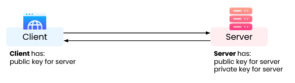
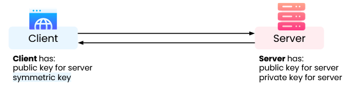
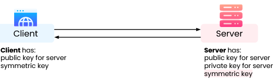
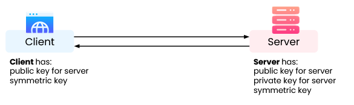

# CodePath 6/11/25 Lecture

## Encryption

### Ciphers and Hashing

-   What is encryption?
    -   The process of converting data into a code
        -   Used to prevent unauthorized access, validate data integrity, or increase information density
        -   Each specific process is called a cipher or algorithm
    -   Decrypting becomes an extra step a bad actor must take once they obtain data
    -   Can be traced back to ancient civilizations
        -   Egypt (~1900 BCE), Greece, Italy
        -   Native peoples of the Northeastern Woodlands (esp. proto-Algonquian speakers)
-   Substitution Ciphers
    -   Substitute one character for another
    -   Can include symbols, numbers, letters, etc.
    -   Reversible
    -   Examples: Caesar cipher, ROT-13, Vernam cipher
-   Transposition Ciphers
    -   Encrypt text by moving pieces of the message around
    -   Think: anagrams
-   Ancient Transposition Cipher: Scytale
    -   Parchment was wrapped around a cylinder
    -   Message made no sense when unwrapped and read downwards
-   These ciphers are not secure
    -   Modern methods make substitution and transposition ciphers obsolete
    -   Still helpful for understanding how data is encrypted
-   Hashing
    -   Transforming a given string of characters into another value
    -   Involves performing a non-reversible algorithm on data
        -   Results in a fixed-length output
        -   Extremely computationally complex to brute force
        -   **Deterministic**: same message results in same hash
-   Hashing Algorithms
    -   Many in common use
        -   MD5, SHA-1, SHA-2, NTLM, LANMAN
-   How Hashing Works: Account Creation

    -   User enters password in plain text: `SPICY-p3pp3r$`
    -   Platform uses an algorithm to create hash: `SHA-1`
    -   Platform stores only the hash: `75c0e6dd7f2bc49889eea8736b866590d1046573...`

-   Salts:
    -   Hashing should ideally happen on users machine.
    -   Adds a little bit of text at the end of the text to be hashed before the algorithmic processing so we wouldn't end up with 2 identical things on a the same input, removing the **deterministic** aspect of hashing.

### Key Encryption

-   Encryption Keys
    -   A random string of bits generated specifically to scramble and unscramble data
    -   Designed to be unique and unpredictable
-   Symmetric-Key Algorithms
    -   Only one key is used to both encrypt and decrypt the data
    -   Requires the key to be exchanged
    -   Sometimes called “secret” key encryption
        -   If the key was public, data could be decrypted by anyone
-   Symmetric-Key Algorithms Visualized
    -   
-   Asymmetric-Key Algorithms
    -   Often called public-key encryption
    -   Pairs of related keys are used to encrypt and decrypt data
        -   One private, one public
    -   Cannot calculate private key from public key
-   Public and Private Keys
    -   Public key is known to all, used to send messages
    -   Private key is only known by the receiver
    -   Example: a journalist receiving secret messages from sources
        -   Public key allows anyone to send an encrypted message
        -   Private key allows only the journalist to decrypt messages
-   Asymmetric Key Algorithms Visualized
    -   
-   Symmetric vs. Asymmetric Cryptography
    -   Both are in use today
    -   Symmetric-key encryption advantages
        -   Tends to be faster
        -   Used for ongoing communication once that handshake has been established
    -   Asymmetric-key encryption advantages
        -   More secure
        -   Avoids key transmission

### Secure Sockets Layer (SSL)

-   Secure Sockets Layer (SSL)
    -   A protocol for encrypting, securing, and authenticating communications that take place on the Internet
        -   Protocol: set of rules, not a specific procedure
    -   Commonly used to secure client-server communications
        -   Also email, VoIP, etc.
    -   Uses both symmetric- and asymmetric-key encryption
-   SSL Certificates
    -   Digital document that validates a website’s identity
    -   Essentially a set of public keys for a server
    -   Signed SSL: a trusted authority has issued the certificate
-   Step 0: Certificate Verification
    -   Client requests SSL certificate from server
    -   Client uses public key to verify the certificate
    -   
-   Step 1: TLS Handshake
    -   Client generates symmetric keys to use only during this session
    -   Client secures the symmetric key using the public key
    -   Client sends symmetric key to server
    -   
-   Step 2: Key Decryption
    -   Server receives the symmetric key from the client
    -   Server decrypts the symmetric key using the private key
    -   
-   Step 3: Data Exchange Continues
    -   Client and server can now communicate securely by encrypting/decrypting messages with the symmetric key
    -   

### Week 2 Project 2: All About SSH Keys

-   In this week's project, we will generate SSH keys and learn how to use them for authentication, encryption and integrity purposes.

#### Part 1: Authentication with SSH Keys

-   SSH keys provide a more secure alternative to password authentication
-   I learned that SSH uses public-key cryptography where you have a key pair:
    -   **Private key**: Kept secret on my local machine
    -   **Public key**: Can be shared and placed on remote servers
-   The authentication process works by the server challenging me to prove I have the private key without actually transmitting it

#### Part 2: Encryption with SSH Keys

-   SSH keys enable secure communication channels between my local machine and remote servers
-   The encryption process ensures that even if someone intercepts the data transmission, they cannot read the actual content
-   This is crucial for protecting sensitive information like passwords, code, and personal data during remote connections

#### Part 3: Setting up Git with SSH Keys

-   I followed the step-by-step process to install Git and set up a demo repository
-   First, I installed Git using: `sudo apt-get install git -y`
-   Then created a demo project directory and initialized an empty Git repository:
    -   `mkdir ~/DemoProject`
    -   `cd ~/DemoProject`
    -   `git init`
-   This gave me the foundation to work with Git version control

#### Part 4: Configuring Git for SSH Signing

-   I configured my Git username and email for commits:
    -   `git config --global user.email "fake.email@google.com"`
    -   `git config --global user.name "vansh"`
-   Next, I enabled GPG signing and set the format to SSH:
    -   `git config --global commit.gpgsign true`
    -   `git config --global gpg.format ssh`
-   This setup ensures that my Git commits will be cryptographically signed for integrity verification

#### Part 5: SSH Key Generation and Registration

-   I used `ssh-agent` to manage my SSH keys securely
-   Generated my SSH key pair and added it to the agent using `ssh-add`
-   The key generation creates both public and private keys that work together for authentication
-   I retrieved my public key using `ssh-add -L` to register it with Git

#### Part 6: Integrity Verification Setup

-   I created a Git allowed signers file to enable commit signature verification
-   Used a complex command to set up the signing configuration:
    -   `echo -n "CYB101 Ubuntu Key " > ~/.ssh/git_allowed_signers && ssh-add -L | head -1 | cut -d " " -f 1,2 | awk -v prefix="* " '{print prefix $0}' >> ~/.ssh/git_allowed_signers`
-   Then configured Git to use this file: `git config --global gpg.ssh.allowedSignersFile ~/.ssh/git_allowed_signers`
-   This ensures that Git can verify the integrity of my commits using SSH signatures

#### Part 7: Testing SSH Commit Signing

-   I made my first signed commit to test the setup:
    -   `git commit --allow-empty --message="Did the SSH signing work?"`
-   Verified that the signing worked using: `git show --show-signature`
-   The output confirmed that my commit was properly signed with my SSH key, showing:
    -   Commit hash and author information
    -   "Good 'git' signature with RSA key" confirmation
    -   My configured name and email
    -   The commit message I wrote

#### Key Takeaways:

-   SSH keys provide three critical security functions: **authentication**, **encryption**, and **integrity**
-   Authentication replaces less secure password-based logins
-   Encryption protects data in transit between local and remote systems
-   Integrity through signing ensures that commits haven't been tampered with
-   The setup process involves multiple steps but creates a robust security foundation for development work
-   SSH key management through `ssh-agent` provides secure key storage and usage
-   Git's integration with SSH signing adds an additional layer of security to version control
-   Some images from the assignment:
    -   
    -   
    -   
    -   
    -   
