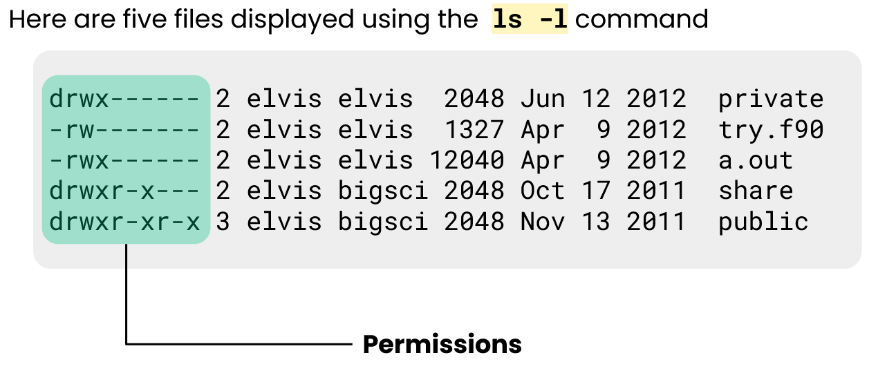
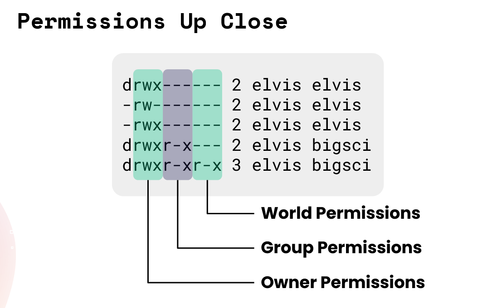
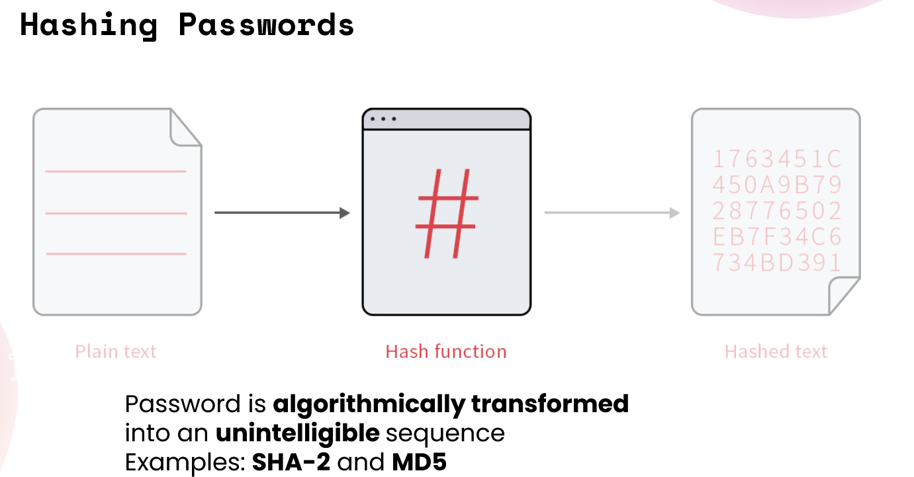
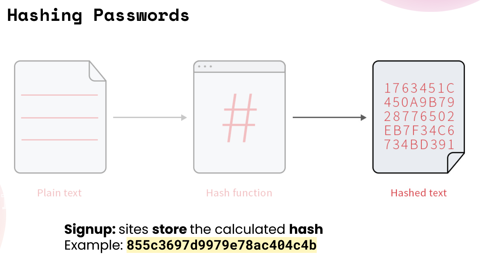
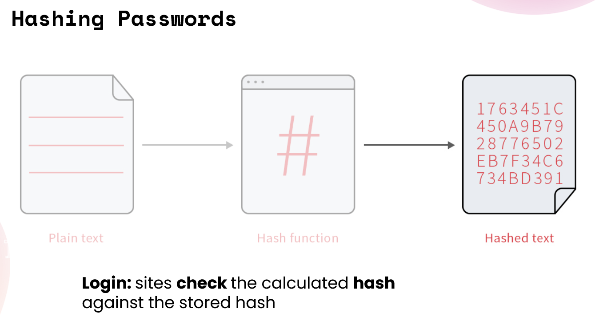

# CodePath 6/11/25 Lecture

## Authentication

-   Sort of falls under confidentiality in the CIA triad, as well as integrity since you don't know who has last changed it, or is allowed to change it.

### Authentication

-   Non-human Identities
    -   Identities that aren’t people
        -   workloads
        -   services
        -   machines
    -   Often constitute the majority of users in many organizations
    -   Often have privileged accounts and larger footprints than human accounts
    -   Traditional static passwords aren’t ideal
        -   Because they are easy to guess, and since it's not a human inputting, it could be much longer and harder to guess making it more secure
-   Securing Device Identities
    -   Public Key Infrastructure: issuance of digital certificates to provide unique digital identities for users
    -   On-device code generation: code generation apps ensure only authorized users can access resources
    -   Mutual authentication: two sides of a communications channel verify each other's identity, instead of only one side verifying the other
    -   Zero trust: don’t grant access to resources until the device verifies its identity
-   Three Factors of Authentication
    -   Something you _know_
    -   Something you _have_
    -   Something you _are_
-   Something you know
    -   Authentication based on secret knowledge
    -   Most commonly used factor
    -   You know a secret that no one else does
        -   Distinguishes you from all other individuals
    -   Examples:
        -   Password
        -   PIN
-   Vulnerabilities: Something You Know
    -   People forget things
    -   People tend to choose passwords/PINs that are easy to remember
    -   People tend to reuse passwords
    -   Eavesdroppers can discover the secret knowledge
-   Something You Have
    -   Authentication based on something in your possession
    -   Often used alongside Something You Know
    -   Examples:
        -   ID Card
        -   Credit Card
-   Vulnerabilities: Something You Have
    -   People lose things
    -   It’s possible to duplicate items such as ID cards
-   Something you are
    -   Authentication based on behavioral and physical characteristics of a person
    -   Can’t be forgotten or lost… typically
    -   Examples:
        -   Fingerprint reader
        -   Voice print
        -   Face recognition
-   Vulnerabilities: Something You Are
    -   Error rates can be high
    -   People tend to have similar physical features
    -   High cost limits availability
    -   Some people are uncomfortable with biometric authentication
-   Multi-factor Authentication
    -   Grant access to a website or application only after successfully presenting two or more pieces of evidence (or type of evidence, something you have/are/know combo) to an authentication mechanism
    -   Protects users when one form of authentication, usually a password, has been compromised

### Permissions and Passwords

-   Unix File Permissions
    -   Every file and directory has:
        -   An owner and a group
        -   A set of permissions for the owner, group, and world (all users who can log into the system)
    -   Types of permissions:
        -   Read: user can see contents
        -   Write: user can modify contents
        -   Execute: user can run a file
    -   
    -   
-   How Passwords Work
    -   Sign up
        -   Encrypt user's preferred password.
        -   Store encrypted string (hash) with the user's record in the database.
    -   Login
        -   User submits their username and password from a login page.
        -   Encrypt the attempted password.
        -   Verify the new hash is the same as the stored hash.
    -   
    -   
    -   
    -   

### Week 3 Project 3: Password Crack-a-thon

-   For this project, I'll be working with a (fictional) leaked password file, modeled after famous data breaches such as the 2012 LinkedIn Hack and 2016 Yahoo Data Breaches.
-   In both of these incidents, usernames and hashed passwords were leaked in simple txt files, making people's private data available to anyone who could crack the hashes.
-   Task is simple: Crack as many hashes as possible, so those passwords can be removed from production and those users' accounts secured.
-   Total number of password cracked:
    -   
-   Command #1: a john command using a different wordlist (not lower.lst)

    -   `john --wordlist=rockyou.txt cp_leak.txt`

-   Command #2: a john command using a built-in ruleset

    -   `john --wordlist=lower.lst cp_leak.txt --rules=shifttoggle`

-   Command #3: a john command using a custom mask
    -   `john --mask=?l?l?l cp_leak.txt` and `john --mask=?l?l?l?l cp_leak.txt` and `john -- mask=?d?d?d?d cp_leak.txt`
