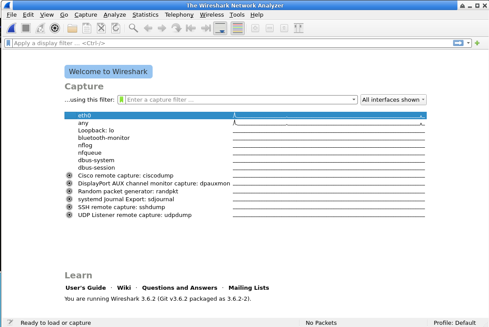

## Wireshark ([LabEx](https://github.com/labex-labs/wireshark-free-tutorials/blob/master/README.md))

### Summary:

-   Using labex to learn more about wireshark

#### Explore and Customize Wireshark Interface:

-   The welcome screen shows list of available network interfaces, which are like doors through which a computer connects to a network
-   Here I can choose one of these interfaces to capture traffic that is going in and out of the computer
-   It also shows the display filter with the option to set a filter for the traffic from the very start
-   
-   
-   Some interfaces like `eth0` refer to Ethernet network and `lo` is the loop back interface

    -   The loopback allows a computer to communicate with itself
    -   

-   Menu Bar Overview:

    -   **File**: Basic file operations - open/save captures, export data
    -   **Edit**: Copy packets, search traffic, set preferences
    -   **View**: Customize interface layout and display options
    -   **Capture**: Start/stop traffic capture, configure filters and interfaces
    -   **Analyze**: Deep packet analysis tools for patterns and anomalies
    -   **Statistics**: Traffic analysis with packet counts and protocol distribution
    -   **Telephony**: VoIP and voice protocol analysis tools
    -   **Wireless**: WiFi-specific analysis including signal strength and channels
    -   **Help**: Documentation and user assistance

-   Toolbar:

    -   Located under menu bar for quick access to common tools
    -   **Start/Stop Capture**: Control traffic capture without using menus
    -   **Open/Save**: File shortcuts for opening/saving captures
    -   **Zoom (+/-)**: Zoom in/out of packet view
    -   **Go To**: Navigate between packets
    -   **Colorize**: Change packet coloring for easier identification

-   Packet List Pane:

    -   Displays captured packets with summary information:
    -   **No.**: Sequential packet number
    -   **Time**: Capture timestamp
    -   **Source**: Sender's IP address
    -   **Destination**: Recipient's IP address
    -   **Protocol**: Highest layer protocol (TCP, UDP, HTTP, etc.)
    -   **Length**: Packet size in bytes
    -   **Info**: Brief packet summary
    -   Click packet for detailed information

-   Packet Details Pane:

    -   Shows detailed packet information in hierarchical format by protocol layers
    -   Layers include: frame, ethernet, IP, TCP, etc.
    -   Click arrows to expand/collapse layers for specific field information

-   Packet Bytes Pane:

    -   Displays raw packet bytes in hexadecimal and ASCII format
    -   **Left column**: Byte offset position
    -   **Middle columns**: Hexadecimal values
    -   **Right column**: ASCII character representation

-   Customizing

    -   You can customize the layout through `Edit > Preferences > Appearance > Layout`
    -   You can create a new column by `right clicking` on any column header in Packet List Pane ` > Column Preferences > + button > Field Type/Name > Title`
    -   Customizing colors: Wireshark uses colors to help you quickly identify different types of traffic. By customizing these color rules, you can make it even easier to distinguish between various packet types.
    -   Customizing Colors:

        1. Go to `View > Coloring Rules`
        2. Click `+` to add new rule
        3. Enter rule name (e.g., "ICMP Packets")
        4. Set display filter (e.g., "icmp")
        5. Choose foreground/background colors
        6. Use up/down buttons to adjust rule priority
        7. Click OK to apply

    -   Saving Profiles:

    -   Save custom configurations as profiles for different analysis tasks
    -   **Steps**: `Edit > Configuration Profiles > + > Enter name > OK`
    -   Switch profiles: `Edit > Configuration Profiles > Select profile`

    -   Restoring Default Settings:

    -   Reset all preferences to default values
    -   **Steps**: `Edit > Preferences > Reset > OK`
