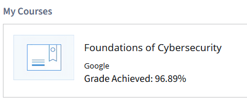

# Foundations of Cybersecurity - Personal Study Notes

## Module 1

### Security Analyst Role Overview

**Core Responsibilities:**

-   Proactively guard against security incidents
-   Monitor systems and networks continuously
-   Investigate and report findings when incidents occur
-   Minimize risks to organizations and users

### Cybersecurity Fundamentals

**Definition:** Practice of ensuring confidentiality, integrity, and availability (CIA Triad) by protecting networks, devices, people, and data from unauthorized access.

**Key Concepts:**

-   **Threat Actor:** Any person/group presenting security risk
-   **External Threats:** Outside attackers targeting private information/systems
-   **Internal Threats:** Current/former employees, vendors, partners (often accidental)

**Examples:**

Scenario: Employee clicks malicious email link
Impact: Potential data breach, system compromise
Prevention: Security awareness training, email filtering

### Business Impact of Security

**Regulatory Compliance:**

-   Meet legal requirements and security standards
-   Avoid fines and audits
-   Uphold ethical obligations to users

**Business Continuity:**

-   Maintain productivity during incidents
-   Reduce downtime and recovery costs
-   Preserve customer trust and brand reputation

**Financial Benefits:**

-   Lower operational risks
-   Reduced incident response costs
-   Maintained revenue through customer retention

**Risk Management:**

Poor Security → Data Breach → Lost Trust → Revenue Loss
Good Security → Compliance → Trust → Business Growth

### Entry-Level Security Analyst Responsibilities

**Three Primary Areas:**

1. **Protecting Computer and Network Systems:**

    - Monitor organization's internal network continuously
    - First responder when threats are detected
    - Participate in penetration testing and ethical hacking
    - Identify vulnerabilities in own organization's systems

2. **Proactive Threat Prevention:**

    - Collaborate with IT teams to install prevention software
    - Identify risks and vulnerabilities before incidents occur
    - Support software and hardware development teams
    - Establish security processes for data protection needs

3. **Conducting Security Audits:**
    - Review organization's security records and activities
    - Examine in-house security issues and access controls
    - Ensure confidential information (passwords, etc.) properly protected
    - Document findings and recommend improvements

**Example Tasks:**

Task: Internal penetration test
Goal: Find network vulnerabilities
Result: Security recommendations for IT team

Task: Security audit review
Focus: Employee password policies
Outcome: Access control improvements

### Common Cybersecurity Terminology

-   **Compliance** is the process of adhering to internal standards and external regulations and enables organizations to avoid fines and security breaches.

-   **Security frameworks** are guidelines used for building plans to help mitigate risks and threats to data and privacy.

-   **Security controls** are safeguards designed to reduce specific security risks. They are used with security frameworks to establish a strong security posture.

-   **Security posture** is an organization’s ability to manage its defense of critical assets and data and react to change. A strong security posture leads to lower risk for the organization.

-   **Network security** is the practice of keeping an organization's network infrastructure secure from unauthorized access. This includes data, services, systems, and devices that are stored in an organization’s network.

-   **Cloud security** is the process of ensuring that assets stored in the cloud are properly configured, or set up correctly, and access to those assets is limited to authorized users.

    -   The cloud is a network made up of a collection of servers or computers that store resources and data in remote physical locations known as data centers that can be accessed via the internet.
    -   Cloud security is a growing subfield of cybersecurity that specifically focuses on the protection of data, applications, and infrastructure in the cloud.

-   **Programming** is a process that can be used to create a specific set of instructions for a computer to execute tasks. These tasks can include:
    -   Automation of repetitive tasks (e.g., searching a list of malicious domains)
    -   Reviewing web traffic
    -   Alerting suspicious activity

### Technical Skills & Tools

**SIEM Tools:**

-   Collect and analyze log data (unusual login behavior, system events)
-   Monitor critical organizational activities
-   Identify potential security threats and vulnerabilities

**Intrusion Detection Systems (IDS):**

-   Monitor system activity for possible intrusions
-   Alert on unauthorized network access
-   Key tool for asset and data protection

**Threat Landscape Knowledge:**

-   Stay current on threat actor tactics and techniques
-   Track malware trends and attack patterns
-   Recognize emerging threats (new ransomware variants)

**Incident Response:**

-   Follow established policies and procedures
-   Investigate security alerts and incidents
-   Identify root causes and remediation strategies

Example: Alert → Investigation → Root Cause Analysis → Remediation

### Data Protection & Privacy

**Legal and Moral Considerations:**

-   Data breaches affect organization reputation and user trust
-   Strong security measures increase customer confidence
-   Security directly impacts financial growth and business referrals

**Data Classification:**

**PII (Personally Identifiable Information):**

-   Full name, date of birth, physical address
-   Phone number, email address, IP address
-   Used to infer individual identity

**SPII (Sensitive PII):**

-   Social security numbers, medical/financial information
-   Biometric data (facial recognition)
-   Stricter handling guidelines required
-   Higher damage potential if compromised

**Identity Theft:**

-   Primary concern when PII/SPII is compromised
-   Act of stealing personal information for fraud
-   Primary objective is financial gain
-   Key target for threat actors during breaches

## Module 2

### Past Cybersecurity Attacks

**Computer Virus/Malware:**

-   Malicious code designed to interfere with computer operations
-   Attaches to programs/documents and spreads across networks
-   Modern term: malware (software designed to harm devices/networks)

**Brain Virus (1986):**

-   Created by Alvi brothers to track illegal medical software copies
-   Unintended consequence: infected any disk inserted into compromised computer
-   Spread globally within months through disk sharing
-   Impact: Slowed productivity, disrupted business operations
-   Lesson: Emphasized need for security planning in computing industry

**Morris Worm (1988):**

-   Created by Robert Morris to assess internet size
-   Failed to track already-compromised computers
-   Continuously re-installed until systems crashed from memory exhaustion
-   Impact: 6,000 computers affected (10% of internet at the time)
-   Cost: Millions in damages from business disruptions
-   Legacy: Led to establishment of Computer Emergency Response Teams (CERTs)

**Historical Significance:**

-   Brain virus: First major demonstration of malware spread potential
-   Morris worm: First internet-scale security incident
-   Both attacks shaped modern cybersecurity response frameworks

### Attacks in the Digital Age

**LoveLetter Malware (2000):**

-   Created by Onel De Guzman to steal internet login credentials
-   Email subject line: "I Love You" with attachment "Love Letter For You"
-   Method: Scanned address book and self-replicated to all contacts
-   Impact: 45 million computers infected globally, $10+ billion in damages
-   Significance: First major example of social engineering attack
-   Legacy: Led to employee training on phishing identification

**Social Engineering:**

-   Manipulation technique exploiting human error
-   Used to gain private information, access, or valuables
-   Modern focus: Phishing through digital communications

**Equifax Breach (2017):**

-   Credit reporting agency infiltration affecting 143 million customers
-   Data stolen: SSNs, birth dates, driver's licenses, addresses, credit cards
-   Impact: Affected approximately 40% of all Americans
-   Cause: Multiple unpatched vulnerabilities over several months
-   Cost: $575+ million in settlements and fines
-   Lesson: Demonstrates cascading effects of security failures

### Common Attack Types

**Phishing:**

-   Use of digital communications to trick people into revealing sensitive data
-   Business Email Compromise (BEC): Fake emails from known sources for financial gain
-   Spear phishing: Targeted emails appearing from trusted sources
-   Whaling: Spear phishing targeting company executives
-   Vishing: Voice communication exploitation for sensitive information
-   Smishing: Text message attacks to obtain information or impersonate sources

**Malware:**

-   Software designed to harm devices or networks for financial or intelligence gain
-   Viruses: Malicious code requiring user initiation, spreads through infected files
-   Worms: Self-replicating malware that spreads across networks independently
-   Ransomware: Encrypts data and demands payment for access restoration
-   Spyware: Gathers and sells information without consent (emails, texts, locations)

**Social Engineering:**

-   Manipulation technique exploiting human error for private information/access
-   Social media phishing: Using social media data to target victims
-   Watering hole attack: Compromising websites frequently visited by target groups
-   USB baiting: Leaving malware-infected USB devices for employees to find
-   Physical social engineering: Impersonating employees/vendors for physical access

**Social Engineering Principles:**

-   Authority: Impersonating individuals with power
-   Intimidation: Using bullying tactics to persuade victims
-   Consensus/Social proof: Claiming others have provided similar access
-   Scarcity: Implying limited availability of goods/services
-   Familiarity: Establishing fake emotional connections
-   Trust: Building relationships over time to exploit
-   Urgency: Pressuring quick responses without questioning

### Incident Response Process

**Primary Objectives:**

1. **Contain the breach** - Stop ongoing data loss immediately
2. **Investigate the breach** - Determine root cause and scope

**Containment Actions:**

-   Shut down compromised servers if necessary
-   Isolate affected data centers
-   Disable communications channels
-   Implement emergency protocols

**Key Principle:**
Stop the data hemorrhaging first, then investigate. Entry-level analysts must focus on executing the incident management plan systematically.

**Response Priority:**
Containment → Investigation → Recovery → Lessons Learned

### CISSP Security Domains (First 4 of 8)

**Domain 1: Security and Risk Management**

-   Defining security goals and objectives
-   Risk mitigation and compliance management
-   Business continuity planning
-   Legal and regulatory requirements
-   Example: Updating company policies for HIPAA compliance changes

**Domain 2: Asset Security**

-   Securing digital and physical assets
-   Data storage, maintenance, retention, and destruction
-   Proper disposal of equipment and confidential information
-   Example: Ensuring old hardware is securely destroyed before disposal

**Domain 3: Security Architecture and Engineering**

-   Optimizing data security through effective tools and systems
-   Implementing security controls and processes
-   Example: Configuring firewalls to monitor and filter network traffic

**Domain 4: Communication and Network Security**

-   Managing and securing physical networks and wireless communications
-   Analyzing user behavior and network activity
-   Creating network policies to prevent exposure
-   Example: Preventing users from connecting to unsecured wireless hotspots

**Key Principle:**
All domains are interconnected - gaps in one domain can negatively impact the entire organization's security posture.

### CISSP Security Domains (Remaining 4 of 8)

**Domain 5: Identity and Access Management**

-   Ensuring users follow established policies for asset control
-   Managing physical assets (office spaces) and logical assets (networks, applications)
-   Validating employee identities and documenting access roles
-   Example: Setting up employee keycard access to buildings

**Domain 6: Security Assessment and Testing**

-   Conducting security control testing and data analysis
-   Performing security audits to monitor risks, threats, and vulnerabilities
-   Regular auditing of user permissions and access levels
-   Example: Auditing payroll access to ensure only authorized employees can view salary information

**Domain 7: Security Operations**

-   Conducting investigations and implementing preventative measures
-   Following organizational policies and procedures for threat response
-   Monitoring and responding to security incidents
-   Example: Responding to alerts about unknown devices connecting to internal networks

**Domain 8: Software Development Security**

-   Using secure coding practices and guidelines
-   Creating secure applications and services
-   Incorporating security into software development lifecycle
-   Example: Advising development teams on password policies and user data protection for mobile apps

**Complete CISSP Framework:**
All 8 domains work together to provide comprehensive organizational security coverage from policy to implementation.

### Attack Types by Domain

**Password Attacks** (Communication and Network Security Domain)

-   Attempts to access password-secured devices, systems, networks, or data
-   Types: Brute force, Rainbow table attacks

**Social Engineering Attacks** (Security and Risk Management Domain)

-   Manipulation techniques exploiting human error for private information/access
-   Types: Phishing, Smishing, Vishing, Spear phishing, Whaling, Social media phishing, BEC, Watering hole, USB baiting, Physical social engineering

**Physical Attacks** (Asset Security Domain)

-   Security incidents affecting both digital and physical environments
-   Types: Malicious USB cables, Malicious flash drives, Card cloning and skimming

**Adversarial Artificial Intelligence** (Communication/Network Security + Identity/Access Management Domains)

-   Manipulation of AI and machine learning technology to conduct attacks more efficiently
-   Spans multiple domains due to AI integration across systems

**Supply-Chain Attacks** (Multiple Domains: Security/Risk Management, Security Architecture/Engineering, Security Operations)

-   Target systems, applications, hardware, software to locate vulnerabilities for malware deployment
-   Affect multiple organizations through third-party processes
-   High cost due to widespread impact

**Cryptographic Attacks** (Communication and Network Security Domain)

-   Affect secure communications between sender and recipient
-   Types: Birthday attacks, Collision attacks, Downgrade attacks

**Domain Mapping:**
Each attack type aligns with specific CISSP domains, helping analysts understand where to focus security controls and incident response efforts.

### Threat Actor Types

**Advanced Persistent Threats (APTs)**

-   Significant expertise in unauthorized network access
-   Research targets in advance (large corporations, government entities)
-   Remain undetected for extended periods
-   Motivations:
    -   Damaging critical infrastructure (power grid, natural resources)
    -   Gaining access to intellectual property (trade secrets, patents)

**Insider Threats**

-   Abuse authorized access to obtain data that may harm organization
-   Motivations:
    -   Sabotage
    -   Corruption
    -   Espionage
    -   Unauthorized data access or leaks

**Hacktivists**

-   Driven by political agenda
-   Abuse digital technology to accomplish goals
-   Motivations:
    -   Demonstrations
    -   Propaganda
    -   Social change campaigns
    -   Fame

**Threat Actor Analysis:**
Understanding motivations helps predict attack methods and implement appropriate defenses for each threat actor type.

## Module 3

### Intro to Security Frameworks and Controls

**Security Frameworks:**

-   Guidelines for building plans to mitigate risks and threats to data and privacy
-   Provide structured approach to implementing security lifecycle
-   Constantly evolving set of policies and standards for managing risks and regulatory compliance

**Framework Purposes:**

-   Protecting PII (Personally Identifiable Information)
-   Securing financial information
-   Identifying security weaknesses
-   Managing organizational risks
-   Aligning security with business goals

**Four Core Components:**

1. **Identifying and Documenting Security Goals**

    - Example: Aligning with EU's GDPR (General Data Protection Regulation)
    - GDPR: Data protection law granting European citizens control over personal data
    - Analysts identify areas of non-compliance

2. **Setting Guidelines to Achieve Security Goals**

    - Develop new policies based on compliance requirements
    - Example: Creating procedures for handling user data requests under GDPR

3. **Implementing Strong Security Processes**

    - Design procedures to ensure organizational compliance
    - Example: Processes for verified user data requests (profile updates/deletions)

4. **Monitoring and Communicating Results**
    - Monitor internal networks for compliance issues
    - Report potential security issues to managers/compliance officers

**Security Controls:**

-   Safeguards designed to reduce specific security risks
-   Example: Privacy training requirements for all employees to reduce data breach risk
-   Use software tools to assign and track training completion

**Framework Integration:**
Analysts work with security teams to document, implement, and use established policies and procedures. Understanding this process is essential for entry-level analysts as it directly affects their work and collaboration methods.

### Secure Design

**CIA Triad - Foundational Security Model**

**Confidentiality:**

-   Only authorized users can access specific assets or data
-   Implemented through strict access controls
-   Defines who should and should not have data access
-   Essential for protecting sensitive information

**Integrity:**

-   Data is correct, authentic, and reliable
-   Protected through encryption and other safeguards
-   Prevents data tampering and unauthorized modifications
-   Ensures data accuracy and trustworthiness

**Availability:**

-   Data is accessible to those authorized to access it
-   Systems and data must be available when needed
-   Balances security with operational requirements
-   Supports business continuity

**Assets:**

-   Items perceived as having value to an organization
-   Value determined by associated costs and risks
-   Examples:
    -   High-value: Applications storing SSNs or bank accounts (requires tighter security)
    -   Lower-value: Public news websites (standard security measures)

**NIST Cybersecurity Framework (NIST CSF):**

-   Voluntary framework with standards, guidelines, and best practices
-   Used to manage cybersecurity risk
-   Serves as baseline for managing short and long-term risks
-   Developed by U.S. National Institute of Standards and Technology

**Risk Management Focus:**

-   Protect organizational assets from threat actors
-   Understand different threat actor motives
-   Identify organization's most valuable assets

**Insider Threat Considerations:**

-   Disgruntled employees are among most dangerous threat actors
-   Have access to sensitive information and know where to find it
-   Risk reduction through principle of availability and organizational guidelines
-   Staff members should only access data needed for their jobs

**Security Implementation:**
CIA Triad principles combined with frameworks like NIST CSF help organizations establish comprehensive security postures that protect assets while maintaining operational efficiency.

### Controls, frameworks, and compliance

**CIA Triad Foundation:**
CIA principles guide cybersecurity professionals in establishing appropriate controls to mitigate threats, risks, and vulnerabilities. Security controls work alongside frameworks to ensure security goals are implemented correctly and regulatory compliance is met.

**Framework Recap:**

-   Guidelines for building plans to mitigate risks and threats
-   Four core components: Identify goals → Set guidelines → Implement processes → Monitor results
-   Compliance: Process of adhering to internal standards and external regulations

**NIST Frameworks:**

-   **NIST CSF (Cybersecurity Framework):** Voluntary compliance framework for risk management
-   **NIST RMF (Risk Management Framework):** Additional risk management guidelines
-   Principle: Higher compliance alignment = Lower organizational risk

### Key Compliance Standards and Frameworks

**FERC-NERC (Federal Energy Regulatory Commission - North American Electric Reliability Corporation)**

-   Applies to electricity organizations and U.S./North American power grid entities
-   Requirements: Prepare for, mitigate, and report security incidents affecting power grid
-   Must adhere to Critical Infrastructure Protection (CIP) Reliability Standards

**FedRAMP (Federal Risk and Authorization Management Program)**

-   U.S. federal government program for cloud services standardization
-   Standardizes security assessment, authorization, monitoring, and handling
-   Provides consistency across government sector and third-party cloud providers

**CIS (Center for Internet Security)**

-   Nonprofit providing controls to safeguard systems and networks
-   Offers actionable controls for security incident response
-   Helps organizations establish better defense plans

**GDPR (General Data Protection Regulation)**

-   European Union regulation protecting E.U. residents' data and privacy rights
-   Applies globally when processing E.U. citizen data
-   Requirements: Data transparency, breach notification within 72 hours
-   Violations result in significant fines

**PCI DSS (Payment Card Industry Data Security Standard)**

-   International security standard for credit card information handling
-   Applies to organizations storing, accepting, processing, transmitting card data
-   Objective: Reduce credit card fraud through secure environments

**HIPAA (Health Insurance Portability and Accountability Act)**

-   U.S. federal law (1996) protecting patients' health information
-   Prohibits sharing patient information without consent
-   Three rules: Privacy, Security, Breach notification
-   Related: HITRUST framework helps institutions meet HIPAA compliance
-   Protects PHI (Protected Health Information) - past, present, future health data

**ISO (International Organization for Standardization)**

-   Establishes international standards for technology, manufacturing, management
-   Helps organizations improve processes, procedures, staff retention, planning
-   Provides cross-border standardization

**SOC (System and Organizations Controls)**

-   **SOC 1 & SOC 2:** AICPA auditing standards for organizational assessments
-   Focuses on user access policies across organizational levels (Associate → Executive → Vendor)
-   Assesses financial compliance, risk levels, confidentiality, privacy, integrity, availability, security
-   Control failures can lead to fraud

**Staying Current:**
Regulations frequently change - security professionals must stay updated on revisions and explore additional frameworks like Gramm-Leach-Bliley Act and Sarbanes-Oxley Act.

**Compliance Strategy:**
Organizations should align with multiple relevant frameworks based on their industry, geographic location, and data types to maintain comprehensive security posture and regulatory compliance.

### Ethics in Cybersecurity

**Core Principle:**
Security professionals must remain unbiased and maintain security and confidentiality, regardless of personal relationships or circumstances. The obligation is to adhere to established policies and protocols at all times.

**Professional Responsibility:**

-   Security teams are entrusted with greater access to data than other employees
-   This privilege must be respected and never abused
-   Ethical behavior is required at all times, even when access allows for rule-bending

**Security Ethics Definition:**
Guidelines for making appropriate decisions as a security professional when faced with moral dilemmas or unclear situations.

### Three Key Ethical Principles

**1. Confidentiality**

-   Ethical duty to keep proprietary or private information (including PII) confidential and safe
-   Never provide system access outside of properly documented channels
-   Violations can result in:
    -   Professional reprimands
    -   Loss of professional reputation
    -   Legal repercussions for all parties involved

**Example Scenario:**
Friend at work makes unauthorized data transfer → Report according to policy, regardless of personal relationship

**2. Privacy Protections**

-   Safeguarding personal information from unauthorized use
-   Follow company policies and procedures, not personal requests
-   Employee information should only be accessed through secure, authorized channels

**Example Scenario:**
Manager requests colleague's personal phone number via email → Decline and refer to proper database access procedures, even for urgent matters

**3. Legal Compliance**

-   Laws are community-recognized rules enforced by governing entities
-   Compliance violations can be both unethical and illegal
-   Negligence resulting in data loss carries serious consequences

**Example Scenario:**
Hospital staff leaves confidential patient files unsupervised on desk → Violation of multiple compliance regulations, resulting in unethical and illegal negligence

**Ethical Decision-Making Framework:**
When facing unclear situations:

1. Consider confidentiality requirements
2. Evaluate privacy protection obligations
3. Review legal compliance requirements
4. Follow established organizational policies and procedures
5. When in doubt, err on the side of security and compliance

**Key Takeaway:**
Ethical behavior in cybersecurity means consistently prioritizing security policies and legal requirements over personal convenience or relationships.

## Module 4

### Common Cybersecurity Tools

**Logs:**

-   Records of events occurring within organization's systems
-   Examples: Employee logins, web service access
-   Help identify vulnerabilities and potential security breaches
-   Essential for security monitoring and incident investigation

**SIEM Tools (Security Information and Event Management)**

-   Applications that collect and analyze log data to monitor critical organizational activities
-   Pronunciation: "sim" or "seem" (using "sim" in this course)
-   Collect real-time information for immediate threat identification
-   Reduce data review burden by providing targeted alerts for specific risks and threats

**Key SIEM Benefits:**

-   Real-time monitoring and alerting
-   Automated data filtering and analysis
-   Centralized log management
-   Faster incident detection and response

**Common SIEM Tools:**

**Splunk Enterprise:**

-   Data analysis platform providing SIEM solutions
-   Self-hosted tool for retaining, analyzing, and searching organizational log data
-   Comprehensive data retention and search capabilities

**Google Chronicle:**

-   Cloud-native SIEM tool for security data storage, search, and analysis
-   Cloud-native advantage: Fast delivery of new features and updates
-   Scalable cloud-based architecture

**SIEM Functionality:**

-   Collect data from multiple sources
-   Analyze and filter data for security teams
-   Enable prevention and quick reaction to potential threats
-   Support incident analysis and proactive threat hunting

**Security Analyst SIEM Tasks:**

-   Analyze filtered events and patterns
-   Perform incident analysis
-   Proactively search for threats
-   Customize tools based on organization's setup and risk focus

### Additional Security Tools

**Playbooks:**

-   Manuals providing operational action details
-   Guide response procedures for security incidents (before, during, after)
-   Cover security reviews, compliance, access management, and documented processes
-   Vary between organizations but provide standardized procedures

**Chain of Custody Playbook:**

-   Process of documenting evidence possession and control during incident lifecycle
-   Document who, what, where, and why evidence is collected
-   Evidence responsibility while in analyst's possession
-   Requirements:
    -   Keep evidence safe and tracked
    -   Report every evidence movement
    -   Maintain continuous location awareness for all parties

**Protecting and Preserving Evidence Playbook:**

-   Process for properly working with fragile and volatile digital evidence
-   Follows order of volatility sequence (first to last data preservation priority)
-   Prioritizes volatile data that may be lost if device powers off
-   Critical principles:
    -   Improper evidence management compromises investigation
    -   Improperly managed evidence cannot be used
    -   First priority: Properly preserve data
    -   Preserve by making copies and investigating using copies only

**Forensic Investigation Priority:**
Proper evidence preservation → Create copies → Investigate using copies → Maintain chain of custody → Document all actions

**Network Protocol Analyzers (Packet Sniffers):**

-   Tools designed to capture and analyze data traffic within networks
-   Essential for network security monitoring and troubleshooting
-   Help identify suspicious network activity and protocol issues

**Common Network Protocol Analyzers:**

-   **tcpdump:** Command-line packet analyzer
-   **Wireshark:** Graphical network protocol analyzer with advanced features

**Tool Integration:**
SIEM tools, playbooks, and network analyzers work together to provide comprehensive security monitoring, incident response, and threat analysis capabilities for security analysts.

### Introduction to Linux, SQL, and Python

**Linux Operating System:**

-   Open-source (publicly available) operating system
-   Relies on command line as primary user interface (unlike MacOS/Windows)
-   Not a programming language but allows text-based commands between user and OS
-   Common security analyst use: Examining logs to understand system activities
-   Example: Using commands to review error logs when investigating high network traffic

**SQL (Structured Query Language):**

-   Programming language for creating, interacting with, and requesting information from databases
-   Database: Organized collection of information or data
-   Handles millions of data points efficiently
-   Security analyst use: Filter through data points to retrieve specific information
-   Essential for database queries and data analysis

**Python Programming Language:**

-   Used by security professionals for repetitive and time-consuming tasks
-   Ideal for tasks requiring high level of detail and accuracy
-   Automation capabilities for security processes
-   Versatile language for security tool development and data analysis

**Programming Skills for Security Analysts:**
These three technologies form the foundation for technical security work:

-   **Linux:** System administration and log analysis
-   **SQL:** Database queries and data investigation
-   **Python:** Automation and custom security tools

**Practical Applications:**

-   Log analysis and system monitoring (Linux)
-   Threat intelligence data queries (SQL)
-   Automated security processes and incident response (Python)

### Use tools to protect business operations

**Web Vulnerability:**

-   Unique flaw in web applications that threat actors can exploit
-   Exploitation methods: Malicious code or behavior
-   Consequences: Unauthorized access, data theft, malware deployment
-   Reference: OWASP Top 10 for most critical web application risks

**Antivirus Software (Anti-malware):**

-   Software program for preventing, detecting, and eliminating malware and viruses
-   Scans device memory to find patterns indicating malware presence
-   Detection capabilities vary by software type
-   Essential for endpoint protection

**Intrusion Detection System (IDS):**

-   Application monitoring system activity and alerting on possible intrusions
-   Scans and analyzes network packets (small data units through networks)
-   Small data size enables easier threat detection process
-   Detection capabilities:
    -   Potential threats to sensitive data
    -   Theft and unauthorized access
    -   Suspicious network activity

**Encryption:**

-   Makes data unreadable and difficult to decode for unauthorized users
-   Primary goal: Ensure confidentiality of private data
-   Process: Converting readable data to cryptographically encoded format
-   Key terms:
    -   **Plaintext:** Unencrypted information
    -   **Secure Ciphertext:** Result of encryption process
    -   **Cryptographic Encoding:** Converting plaintext into secure ciphertext

**Note:** Encoding vs. Encryption

-   Encoding: Uses public conversion algorithms for data representation sharing between systems
-   Encryption: Uses cryptographic methods for confidentiality and security

**Penetration Testing (Pen Testing):**

-   Simulated attack to identify vulnerabilities in systems, networks, websites, applications, and processes
-   Comprehensive risk assessment tool
-   Evaluation capabilities:
    -   External threats and vulnerabilities
    -   Internal threats and weaknesses
    -   Overall security posture assessment
-   Helps organizations proactively identify and address security gaps

**Security Tool Integration:**
These tools work together to provide layered security:

-   **Web vulnerability scanning** identifies application flaws
-   **Antivirus software** protects endpoints from malware
-   **IDS** monitors network activity for intrusions
-   **Encryption** protects data confidentiality
-   **Penetration testing** validates overall security effectiveness

**Operational Security Strategy:**
Combining multiple security tools and practices creates comprehensive protection against various threat vectors and attack methods.

# Certificate Completed

