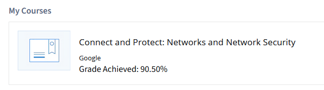

# Connect and Protect Networks and Network Security

## Module 1

### What are networks?

A network is a group of connected devices that can communicate with each other.

-   **Home network:** Devices like laptops, cell phones, and smart appliances (e.g., refrigerator, air conditioner) connect together.
-   **Office network:** Workstations, printers, and servers are all connected.

Devices communicate over network cables or wireless connections. Networks in different locations can also communicate with each other.

**Device addresses:**

-   Devices use unique identifiers to find and communicate with each other.
-   **IP address:** Identifies devices on a network.
-   **MAC address:** Unique hardware identifier for network interfaces.

**Types of networks:**

-   **Local Area Network (LAN):** Covers a small area (home, office, school).
    -   Example: Your phone and tablet connected to home WiFi form a LAN.
    -   LANs connect to the internet.
-   **Wide Area Network (WAN):** Covers a large area (city, state, country).
    -   The internet is a global WAN.
    -   Example: Employees in different countries can share resources.

---

### Network Tools

**Hub:**

-   Broadcasts information to every device on the network (like a radio tower).
-   Not secure; sends data to all devices regardless of destination.

**Switch:**

-   Connects specific devices by sending/receiving data only to the intended destination.
-   More secure and efficient than a hub; controls traffic flow and improves performance.

**Router:**

-   Connects multiple networks together.
-   Forwards data between networks by reading destination addresses.
-   Example: Sends info from a computer in one network to a tablet in another network via routers.

**Modem:**

-   Connects your router to the internet, bringing internet access to the LAN.
-   Transfers data between local networks and the internet.

**Virtualization tools:**

-   Software that performs network operations usually handled by physical devices (hub, switch, router, modem).
-   Offered by cloud service providers; enable network functions without physical hardware.

---

### Network devices

Network devices maintain information and services for users of a network. They connect over wired and wireless connections and send data packets, which contain source and destination info. This is how devices communicate across the network.

The network is the overall infrastructure that allows devices to communicate. Network devices (like routers and switches) manage what is sent and received. Devices such as computers and phones connect to the network through these devices.

**Example network diagram:**  
A router connects to the internet via a modem (provided by your ISP). The firewall monitors traffic between your network and the internet. The router directs traffic to devices on your home network (computers, laptops, smartphones, tablets, printers, etc.). A server (e.g., file server) can be accessed by all devices. A switch can be added for more ports and Ethernet connections. Multiple routers connected to a switch can be used for load balancing.

---

#### Devices and desktop computers

Everyday devices (PCs, laptops, phones, tablets) each have a unique MAC and IP address. They use a network interface to send/receive data packets and can connect via wired or wireless connections.

---

#### Firewalls

A firewall is a network security device that monitors and restricts traffic to/from your network. It acts as the first line of defense, enforcing security rules set by the organization. Firewalls are placed between the internal network and untrusted external networks (like the internet).

---

#### Servers

Servers provide information and services for network devices (clients). In the client-server model, clients request info/services from servers. Examples:

-   **DNS servers:** Domain name lookups
-   **File servers:** Store/retrieve files
-   **Mail servers:** Organize company email

---

#### Hubs and switches

-   **Hub:** Common connection point for devices; repeats all info to all ports. Vulnerable to eavesdropping, less common in modern networks.
-   **Switch:** Preferred for most networks; forwards packets only to intended devices using MAC address tables. Part of the data link layer in TCP/IP. Improves performance and security.

---

#### Routers

Routers connect networks and direct traffic based on IP addresses. They allow devices on different networks to communicate. Routers read the IP header and forward packets to the next router until reaching the destination. Some routers include firewall features to block malicious traffic.

---

#### Modems and wireless access points

-   **Modem:** Connects home/office to ISP, converts signals for network use. Usually connects to a router.
-   **Enterprise networks:** Use other broadband tech for high-volume traffic.
-   **Wireless access point:** Sends/receives signals over radio waves, creating a wireless network. Devices connect via Wi-Fi protocols.

---

#### Using network diagrams as a security analyst

Network diagrams map out devices and connections in a network. They use graphics for devices and lines for connections. Security analysts use diagrams to understand and secure network architecture.

---

### Cloud Networks

Cloud computing is the practice of using remote servers, applications, and network services hosted on the internet instead of local physical devices. More businesses are moving to cloud computing each year, so understanding cloud networks and their security is essential.

A **cloud network** is a collection of servers or computers that store resources and data in a remote data center, accessible via the internet. These servers are "in the cloud" because companies don't house them at their physical location.

#### Key differences from traditional networks:

-   Traditional networks host web servers on-site.
-   Cloud networks use remote servers, enabling access to services and applications from any location.

#### Cloud service providers:

-   Offer alternatives to on-premise networks.
-   Maintain applications, provide on-demand storage and processing power (pay-as-needed).
-   Supply business and web analytics for monitoring traffic and sales.

#### Cloud security:

-   Becomes more important as organizations migrate to cloud services.
-   Security professionals must focus on both network-based and identity-based security.
-   Verifying both the source of traffic and the identity behind it is critical in cloud environments.

Cloud networks allow organizations to benefit from scalable resources and remote access, but require new approaches to security and management. Understanding the shared responsibility model is essential, as cloud providers and customers both handle different aspects of security.

### Cloud computing and software-defined networks

#### Computing processes in the cloud

Traditional networks are called **on-premise networks**, meaning all devices for network operations are kept at a physical location owned by the company (e.g., an office building).  
**Cloud computing** uses remote servers, applications, and network services hosted on the internet instead of at a company-owned physical location.

A **cloud service provider (CSP)** is a company that offers cloud computing services. CSPs own large data centers worldwide, housing millions of servers. These data centers provide technology services (storage, compute) at scale, which companies can purchase and access via the CSP’s API or web console.

#### CSPs provide three main categories of services:

-   **Software as a Service (SaaS):**  
    Software suites operated by the CSP that companies use remotely without hosting the software themselves.

-   **Infrastructure as a Service (IaaS):**  
    Virtual computer components (containers, storage) offered by the CSP, configured remotely. Used to operate existing applications and workloads without major changes, or to take advantage of cloud-specific features.

-   **Platform as a Service (PaaS):**  
    Tools for application developers to design custom cloud applications for specific business needs.

_Each service type connects to a physical data center, but organizations interact with virtual resources._

#### Hybrid cloud environments

-   Using both CSP services and on-premise computers, networks, and storage is called a **hybrid cloud environment**.
-   Using more than one CSP is called a **multi-cloud environment**.
-   Most organizations use hybrid cloud to reduce costs and maintain control over resources.

#### Software-defined networks (SDN)

-   CSPs offer networking tools similar to physical devices, but as virtual services.
-   **Software-defined networks (SDNs)** use virtual network devices (switches, routers, firewalls, etc.).
-   Modern hardware supports network virtualization and SDN, using software for packet routing.
-   In cloud networking, SDN tools are hosted on servers at the CSP’s data center.

#### Benefits of cloud computing and SDN

-   **Reliability:**  
    Cloud services are highly available, secure, and consistently running, allowing employees and customers to access resources with minimal interruption.

-   **Cost:**  
    CSPs offer virtual devices/services at a lower cost than installing and maintaining hardware/software on-premise.

-   **Scalability:**  
    Cloud services are elastic—companies pay only for what they need, when they need it.  
    Changes can be made quickly via CSP APIs or web consoles, without waiting for hardware purchases or setup.

    _Example:_  
    If a company needs to protect against a network threat, web application firewalls (WAFs), IDS/IPS, or L3/L4 firewalls can be configured quickly for better performance

### Introduction to network configurations

Communication over a network happens when data is transferred from one point to another. Pieces of data are typically referred to as **data packets**.

#### What is a data packet?

A data packet is a basic unit of information that travels from one device to another within a network.

-   When data is sent across a network, it is sent as a packet containing:
    -   The destination address (where it's going)
    -   The source address (where it's coming from)
    -   The content/message

**Analogy:**  
Think of a data packet like a piece of physical mail:

-   The envelope has the destination and return address.
-   Inside is the letter (the message).
-   The envelope may have a signature at the end (footer).

#### Packet structure

-   **Header:** Contains the IP address and MAC address of the destination device, and a protocol number that tells the receiving device how to handle the packet.
-   **Body:** Contains the actual message or data.
-   **Footer:** Signals to the receiving device that the packet is finished (like a signature).

#### Network performance

-   **Bandwidth:** The amount of data a device receives every second.
    -   Calculated by dividing the quantity of data by the time in seconds.
-   **Speed:** The rate at which data packets are received or downloaded.

Security personnel monitor bandwidth and speed because irregularities can indicate a network attack.

#### Packet sniffing

Packet sniffing is the practice of capturing and inspecting data packets across the network to analyze traffic

### The TCP/IP Model

TCP/IP stands for **Transmission Control Protocol** and **Internet Protocol**. It is the standard model used for network communication.

#### TCP (Transmission Control Protocol)

-   Allows two devices to form a connection and stream data.
-   Organizes data so it can be sent across a network.
-   Establishes a connection between devices and ensures packets reach their destination.

#### IP (Internet Protocol)

-   Provides standards for routing and addressing data packets between devices.
-   Assigns an IP address to each device or private network for identification.

#### Ports

When data packets are sent and received across a network, they are assigned a **port**.

-   A port is a software-based location within the operating system that organizes the sending and receiving of data.
-   Ports divide network traffic into segments based on the service they perform between devices.
-   Devices use port numbers to prioritize and process data segments.

**Analogy:**  
Sending a letter to a friend in an apartment building—the mail carrier finds the building (IP address) and the specific apartment (port number).

#### Port numbers

Port numbers tell the receiving device what to do with the information.

-   Computers use port numbers to split network traffic and prioritize operations.

**Common port numbers:**

-   **Port 25:** Used for email (SMTP)
-   **Port 443:** Used for secure internet communication (HTTPS)
-   **Port 20:** Used for large file transfers (FTP data)

TCP/IP enables reliable, organized, and secure communication between devices on a network

#### The four layers of the TCP/IP Model

The TCP/IP model is a framework used to visualize how data is organized and transmitted across a network. This model helps network engineers and security analysts conceptualize processes and communicate where disruptions or threats occur.

The TCP/IP model has four layers:

1. **Network Access Layer** (sometimes called the data link layer)

    - Handles creation and transmission of data packets across the network.
    - Includes hardware devices, physical cables, switches, hubs, and modems.
    - Address Resolution Protocol (ARP) operates here, mapping IP addresses to MAC addresses for local communication.

2. **Internet Layer** (also called the network layer)

    - Attaches IP addresses to data packets to indicate sender and receiver locations.
    - Manages how networks connect to each other.
    - **Protocols:**
        - **Internet Protocol (IP):** Routes packets between networks.
        - **Internet Control Message Protocol (ICMP):** Shares error info and status updates, useful for troubleshooting and reporting dropped packets.

3. **Transport Layer**

    - Uses protocols to control the flow of traffic across the network.
    - Permits or denies communication, includes connection status, and handles error control.
    - **Protocols:**
        - **Transmission Control Protocol (TCP):** Reliable, connection-oriented; ensures data reaches its destination and uses port numbers.
        - **User Datagram Protocol (UDP):** Connectionless, used for real-time applications (e.g., video streaming); less reliable but faster.

4. **Application Layer**
    - Determines how data packets interact with receiving devices.
    - Organizes functions like file transfers and email services.
    - Responsible for making/responding to network requests.
    - **Protocols:**
        - **HTTP:** Web browsing
        - **SMTP:** Email
        - **SSH:** Secure remote access
        - **FTP:** File transfers
        - **DNS:** Domain name lookups

Application layer protocols rely on the underlying layers to transfer data across the network.

---

#### More about the OSI Model

The OSI (Open Systems Interconnection) Model visually organizes network protocols into seven layers. Each layer has specific functions and protocols, helping network professionals communicate about sources of problems or security threats.

**Layer 7: Application Layer**

-   Directly involves the user and software applications.
-   Protocols: HTTP/HTTPS (web browsing), SMTP (email), DNS (domain name resolution).

**Layer 6: Presentation Layer**

-   Handles data translation, formatting, and encryption.
-   Functions: Encryption (SSL for HTTPS), compression, character code translation.

**Layer 5: Session Layer**

-   Manages sessions (connections) between devices.
-   Functions: Authentication, reconnection, checkpoints, session establishment and termination.

**Layer 4: Transport Layer**

-   Delivers data between devices, manages speed, flow, and segmentation.
-   Protocols: TCP (reliable), UDP (fast, connectionless).

**Layer 3: Network Layer**

-   Routes data packets between networks using IP addresses.
-   Protocols: IP, ICMP.

**Layer 2: Data Link Layer**

-   Organizes sending/receiving data packets within a single network.
-   Devices: Switches, network interface cards.
-   Protocols: NCP, HDLC, SDLC.

**Layer 1: Physical Layer**

-   Corresponds to physical hardware (hubs, modems, cables, wiring).
-   Converts data packets into streams of 0s and 1s for transmission.

---

**Summary:**  
The OSI model divides network communication into seven layers, while the TCP/IP model uses four layers. Both models help professionals troubleshoot, secure, and understand network processes by mapping protocols and functions to specific layers

### IP addresses and network communication

An **internet protocol address (IP address)** is a unique string of characters that identifies the location of a device on the internet, similar to how every house on a street has its own mailing address.

#### Types of IP addresses

-   **IPv4:**  
    Written as four 1, 2, or 3-digit numbers separated by decimal points (e.g., `192.168.1.1`).  
    Originally, all internet addresses were IPv4, but as the internet grew, the available addresses were exhausted.

-   **IPv6:**  
    Made up of 32 hexadecimal characters, separated by colons (e.g., `2001:0db8:85a3:0000:0000:8a2e:0370:7334`).  
    IPv6 allows for a much larger number of devices to be connected to the internet.

#### Public vs. Private IP addresses

-   **Public IP address:**  
    Assigned by your internet service provider (ISP) and connected to your geographic location.  
    All devices on your network share the same public-facing IP address when communicating with the internet (like roommates sharing a mailing address).

-   **Private IP address:**  
    Used only within your local network.  
    Devices on your home network communicate with each other using unique private IP addresses that are not visible to the rest of the internet.

#### MAC addresses

A **MAC address** is a unique alphanumeric identifier assigned to each physical device on a network.

-   When a switch receives a data packet, it reads the MAC address of the destination device and maps it to a port.
-   The switch keeps this information in a **MAC address table**, which acts like an address book to direct data packets to the correct device.

Understanding IP and MAC addresses is essential for managing network communication and ensuring data reaches the intended destination

### Components of network layer communication

#### Operations at the network layer

The network layer organizes the addressing and delivery of data packets from the host device to the destination device. This includes directing packets from one router to another across the internet until they reach the destination IP address, which is contained in the header of each data packet. Routers use routing tables to store and reference this information along the packet’s path.

All data packets include an IP address. A data packet is also referred to as an **IP packet** for TCP connections or a **datagram** for UDP connections. Routers use the IP address in the packet header to route packets between networks. The header contains more than just the destination address—it also includes the source IP address, packet size, and protocol information.

#### Format of an IPv4 packet

An IPv4 packet is made up of two sections: the header and the data.

-   **Header:**

    -   Determined by the IPv4 protocol and includes routing information.
    -   Size ranges from 20 to 60 bytes.
    -   First 20 bytes: fixed information (source/destination IP, header length, total length).
    -   Last 0–40 bytes: options field.

-   **Data:**
    -   Varies in size, up to a maximum of 65,535 bytes.
    -   Contains the message being transferred (e.g., website info, email text).

**IPv4 header fields:**

-   **Version (VER):** Protocol version (IPv4).
-   **Header Length (HLEN/IHL):** Where header ends and data begins.
-   **Type of Service (ToS):** Packet delivery priority.
-   **Total Length:** Total size of packet (header + data).
-   **Identification:** Unique ID for fragmented packets.
-   **Flags:** Info about fragmentation.
-   **Fragmentation Offset:** Position of fragment in original packet.
-   **Time to Live (TTL):** Limits packet lifetime; decremented by each router.
-   **Protocol:** Protocol used for data portion.
-   **Header Checksum:** Detects header corruption.
-   **Source IP Address:** IPv4 address of sender.
-   **Destination IP Address:** IPv4 address of recipient.
-   **Options:** Security options if header length > 5.

---

#### Difference between IPv4 and IPv6

As the internet grew, IPv4 addresses became depleted (IPv4 address exhaustion). IPv6 was developed to solve this and other concerns.

-   **IPv4:**

    -   Four decimal numbers separated by periods (e.g., `198.51.100.0`).
    -   4 bytes, up to 4.3 billion addresses.

-   **IPv6:**
    -   Eight hexadecimal numbers separated by colons (e.g., `2002:0db8:0000:0000:0000:ff21:0023:1234`).
    -   16 bytes, up to 340 undecillion addresses.
    -   Consecutive zeros can be replaced with `::` (e.g., `2002:0db8::ff21:0023:1234`).

-   **IPv6 header:**
    -   Simpler than IPv4.
    -   No IHL, Identification, or Flags fields.
    -   Introduces Flow Label for special handling.

**Security differences:**

-   IPv6 offers more efficient routing and eliminates private address collisions that can occur with IPv4.

Understanding packet structure and addressing is essential for network communication, routing, and security

## Module 2

### Network protocol

Networks benefit from having rules to ensure data gets to the right place. These rules are called **network protocols**—sets of standards used by devices to define the order of delivery and the structure of data.

#### How network protocols work together

**Scenario:**  
You want to access your favorite recipe website, www.yummyrecipesforme.org.

1. **TCP (Transmission Control Protocol):**

    - Your device establishes communication with the web server using TCP.
    - TCP allows two devices to form a connection and stream data.
    - It verifies both devices before allowing further communication (TCP handshake).

2. **ARP (Address Resolution Protocol):**

    - As data packets move across the network, ARP determines the MAC address of the next router or device on the path.
    - Ensures data reaches the correct destination.

3. **HTTPS (Hypertext Transfer Protocol Secure):**

    - Provides a secure method of communication between your browser and the website server.
    - Allows your browser to securely send a request for a webpage and receive a response.
    - Encrypts data using SSL/TLS to protect information from malicious actors.

4. **DNS (Domain Name System):**
    - Translates internet domain names into IP addresses.
    - Sends the domain name to a DNS server, which retrieves the IP address of the website.

**Summary:**  
Just by visiting one website, your device uses multiple protocols: TCP, ARP, HTTPS, and DNS. These protocols work together to establish connections, route data, secure communications, and translate addresses.

**Security note:**  
Protocols like HTTPS encrypt data using SSL/TLS, helping keep information secure from attackers.

Network protocols are essential for reliable, secure, and efficient communication across networks

### Common Network Protocols

#### Overview of network protocols

A **network protocol** is a set of rules used by devices on a network to describe the order of delivery and the structure of data. Protocols act as instructions that tell the receiving device what to do with the data, allowing devices worldwide to communicate and understand each other.

Security analysts should understand the security implications of protocols, as some have vulnerabilities that can be exploited. For example, attackers may use the DNS protocol to redirect traffic to malicious sites.

---

#### Three categories of network protocols

Network protocols are divided into three main categories: **communication protocols**, **management protocols**, and **security protocols**.

---

#### Communication Protocols

-   **Transmission Control Protocol (TCP):**

    -   Allows two devices to form a connection and stream data.
    -   Uses a three-way handshake (SYN, SYN/ACK, ACK).
    -   Occurs at the transport layer.

-   **User Datagram Protocol (UDP):**

    -   Connectionless, does not establish a connection before transmission.
    -   Less reliable but faster; used for DNS requests and real-time applications.
    -   Occurs at the transport layer.

-   **Hypertext Transfer Protocol (HTTP):**

    -   Application layer protocol for communication between clients and website servers.
    -   Uses port 80; considered insecure (replaced by HTTPS).
    -   Occurs at the application layer.

-   **Domain Name System (DNS):**
    -   Translates domain names into IP addresses.
    -   Uses UDP on port 53 (switches to TCP for large replies).
    -   Occurs at the application layer.

---

#### Management Protocols

-   **Simple Network Management Protocol (SNMP):**

    -   Used for monitoring and managing network devices.
    -   Can reset passwords, change configurations, and report bandwidth usage.
    -   Occurs at the application layer.

-   **Internet Control Message Protocol (ICMP):**
    -   Used for error reporting and troubleshooting (e.g., "ping" command).
    -   Occurs at the internet layer.

---

#### Security Protocols

-   **Hypertext Transfer Protocol Secure (HTTPS):**

    -   Secure version of HTTP; uses SSL/TLS encryption.
    -   Uses port 443; protects data in transit.
    -   Occurs at the application layer.

-   **Secure File Transfer Protocol (SFTP):**
    -   Secure protocol for transferring files over a network.
    -   Uses SSH (TCP port 22) and encryption (AES, etc.).
    -   Occurs at the application layer; commonly used for cloud storage.

> **Note:** Encryption protocols do not conceal the source or destination IP address, so basic information about network traffic can still be intercepted.

---

Understanding these protocols and their categories is essential for reliable, secure, and efficient network communication

### Additional Network Protocols

#### Network Address Translation (NAT)

Devices on a local network have private IP addresses for internal communication. To communicate with the public internet, these devices use a single public IP address, typically assigned by the router. NAT replaces private source IP addresses with the router's public IP address for outgoing messages and reverses the process for incoming responses. NAT is configured on routers or firewalls and operates at the internet and transport layers of the TCP/IP model.

---

#### Public vs Private IP Addresses

| Private IP Addresses               | Public IP Addresses                |
| ---------------------------------- | ---------------------------------- |
| Assigned by the router             | Assigned by ISP and IANA           |
| Unique only within private network | Unique in the global internet      |
| No cost to use                     | Costs to lease a public IP address |
| Address ranges:                    | Assignable address ranges:         |
| - 10.0.0.0–10.255.255.255          | - 1.0.0.0–9.255.255.255            |
| - 172.16.0.0–172.31.255.255        | - 11.0.0.0–126.255.255.255         |
| - 192.168.0.0–192.168.255.255      | - 128.0.0.0–172.15.255.255         |
|                                    | - 172.32.0.0–192.167.255.255       |
|                                    | - 192.169.0.0–233.255.255.255      |

---

#### Dynamic Host Configuration Protocol (DHCP)

DHCP is a management protocol at the application layer. It works with routers to assign unique IP addresses to devices and provides DNS server and default gateway addresses.

-   **DHCP servers:** UDP port 67
-   **DHCP clients:** UDP port 68

---

#### Address Resolution Protocol (ARP)

ARP translates IP addresses in data packets into MAC addresses for hardware devices. Each device maintains an ARP cache of IP/MAC address mappings. ARP is a network access layer protocol and does not use port numbers.

---

#### Telnet

Telnet is an application layer protocol for connecting to remote systems using command line prompts. It sends information in clear text and is less secure than SSH.

-   **Port:** TCP 23

---

#### Secure Shell (SSH)

SSH creates a secure, encrypted connection to remote systems, replacing Telnet for secure authentication and communication.

-   **Port:** TCP 22

---

#### Post Office Protocol (POP3)

POP3 is used to manage and retrieve email from a mail server.

-   **Unencrypted:** TCP/UDP port 110
-   **Encrypted (SSL/TLS):** TCP/UDP port 995

---

#### Internet Message Access Protocol (IMAP)

IMAP is used for incoming email, allowing users to access and sync emails across multiple devices.

-   **Unencrypted:** TCP port 143
-   **Encrypted (TLS):** TCP port 993

---

#### Simple Mail Transfer Protocol (SMTP/SMTPS)

SMTP transmits and routes email from sender to recipient.

-   **Unencrypted:** TCP/UDP port 25
-   **Encrypted (TLS/SMTPS):** TCP/UDP port 587

---

#### Protocol and Port Chart

| Protocol | Port(s)                                          |
| -------- | ------------------------------------------------ |
| DHCP     | UDP 67 (server), UDP 68 (client)                 |
| ARP      | None                                             |
| Telnet   | TCP 23                                           |
| SSH      | TCP 22                                           |
| POP3     | TCP/UDP 110 (unencrypted), TCP/UDP 995 (SSL/TLS) |
| IMAP     | TCP 143 (unencrypted), TCP 993 (TLS)             |
| SMTP     | TCP/UDP 25 (unencrypted)                         |
| SMTPS    | TCP/UDP 587 (TLS)                                |

---

### Wireless Protocols

**IEEE 802.11**, commonly known as Wi-Fi, is a set of standards that define communications for wireless local area networks (LANs).

-   **IEEE** stands for the Institute of Electrical and Electronics Engineers, the organization that maintains Wi-Fi standards.
-   **802.11** refers to the suite of protocols used in wireless communications.

Wi-Fi protocols have evolved to provide greater security and reliability, aiming to match the security level of wired connections.

#### The evolution of wireless security protocols

In the early days of the internet, all communication happened over physical cables. Wireless internet became possible after the mid-1980s, when radio wave frequencies were designated for unlicensed use. By the late 1990s and early 2000s, technologies emerged to send and receive data over radio, enabling wireless access for laptops, smartphones, tablets, desktops, and smart devices.

**Wi-Fi** refers to a set of standards for wireless LANs, based on the IEEE 802.11 family. The Wi-Fi Alliance maintains these standards.

Wireless security protocols have evolved to address vulnerabilities and improve protection:

---

##### Wired Equivalent Privacy (WEP)

-   Developed in 1999 to provide privacy for wireless connections similar to wired ones.
-   WEP is now considered insecure and high-risk due to weak encryption.
-   Still found on older devices or networks where the default protocol was never changed.

---

##### Wi-Fi Protected Access (WPA)

-   Introduced in 2003 to replace WEP and address its security flaws.
-   Uses Temporal Key Integrity Protocol (TKIP) and larger secret keys.
-   Includes message integrity checks to detect tampering.
-   Vulnerable to key reinstallation attacks (KRACK), allowing attackers to bypass encryption.

---

##### WPA2

-   Released in 2004, WPA2 uses Advanced Encryption Standard (AES) and CCMP for stronger encryption and message integrity.
-   Considered the security standard for Wi-Fi today.
-   Vulnerable to KRACK attacks, leading to the development of WPA3.

**WPA2 Personal:**

-   Suited for home networks; uses a global passphrase for all devices.

**WPA2 Enterprise:**

-   Designed for business; offers centralized control and individualized access, preventing users from accessing encryption keys.

---

##### WPA3

-   Released in 2018, WPA3 addresses WPA2 vulnerabilities.
-   Uses Simultaneous Authentication of Equals (SAE) to prevent handshake attacks.
-   Provides stronger encryption (128-bit for personal, optional 192-bit for enterprise).
-   Prevents attackers from capturing and decoding wireless traffic.

---

Wireless security protocols have evolved from WEP to WPA, WPA2, and WPA3, each improving encryption and protection against attacks. As a security analyst, understanding these protocols helps you assess and secure wireless networks

### Firewalls and network security measures

A **firewall** is a network security device that monitors traffic to and from your network. It allows or blocks traffic based on a defined set of security rules.

#### Firewall functions

-   **Port filtering:**  
    Blocks or allows certain port numbers to limit unwanted communication.  
    Example: Allow only port 443 (HTTPS) or port 25 (email), block others.

-   **Security policy:**  
    Firewall settings are determined by the organization's security policy.

#### Types of firewalls

-   **Hardware firewall:**  
    Physical device that inspects each data packet before it enters the network. Basic defense against threats.

-   **Software firewall:**  
    Program installed on a computer or server.

    -   On a computer: Analyzes all traffic received by that device.
    -   On a server: Protects all devices connected to the server.
    -   Typically costs less and doesn't require extra space, but adds processing burden.

-   **Cloud-based firewall (Firewall as a Service, FaaS):**  
    Software firewall hosted by a cloud service provider.
    -   Organizations configure rules via the provider's interface.
    -   Protects both onsite networks and cloud assets.

#### Stateful vs. stateless firewalls

-   **Stateful firewall:**  
    Tracks information passing through, analyzes traffic for suspicious behavior, and proactively filters threats.

-   **Stateless firewall:**  
    Operates based on predefined rules, does not track information from data packets, and only acts according to programmed rules. Less secure than stateful firewalls.

#### Next Generation Firewall (NGFW)

-   Provides stateful inspection and additional security functions like deep packet inspection and intrusion protection.
-   May connect to cloud-based threat intelligence services for rapid updates against emerging threats.

---

Firewalls are essential for network security, helping organizations control access, filter traffic, and protect against cyber threats

### Virtual Private Networks (VPNs)

When you connect to the internet, your internet service provider (ISP) receives your network's requests and forwards them to the correct destination server. These requests can include private information, such as your physical location and personal data (e.g., bank accounts, credit card numbers). If this traffic is intercepted, someone could potentially link your internet activity to your identity.

A **virtual private network (VPN)** is a network security service that changes your public IP address and hides your virtual location, helping keep your data private when using public networks like the internet.

#### How VPNs protect your data

-   **Encryption:**  
    VPNs encrypt your data as it travels across the internet, preserving confidentiality.

-   **Encapsulation:**  
    VPN services encapsulate your data in transit by wrapping sensitive data in other data packets.

    -   The MAC and IP address of the destination device are normally visible in packet headers and footers, which can expose your network's location.
    -   Encapsulation allows VPNs to encrypt your data packets and then wrap them in outer packets that routers can read, so your requests reach their destination while your personal data remains unreadable in transit.

-   **Encrypted tunnel:**  
    VPNs create an encrypted tunnel between your device and the VPN server.
    -   The encryption is unbreakable without a cryptographic key, preventing unauthorized access to your data.

VPNs are essential for maintaining privacy and security, especially when using public networks.

### Security Zones

**Security zones** are segments of a network designed to protect the internal network from the internet. This technique, called **network segmentation**, divides the network into segments, each with its own access permissions and security rules.

#### Purpose of security zones

-   Control who can access different parts of the network
-   Act as barriers to internal networks
-   Maintain privacy within groups or departments
-   Prevent issues from spreading across the entire network

**Example:**  
A hotel offers free public Wi-Fi for guests, which is kept separate from an encrypted staff network.  
A university may have a faculty subnet and a separate student subnet; if the student subnet is compromised, it can be isolated to protect the rest of the network.

#### Types of security zones

-   **Uncontrolled zone:**  
    Any network outside the organization's control, such as the internet.

-   **Controlled zone:**  
    Subnetworks that protect the internal network from the uncontrolled zone.

    -   **Demilitarized Zone (DMZ):**  
        Contains public-facing services (web servers, proxy servers, DNS servers, email/file servers). Acts as a network perimeter.

    -   **Internal network:**  
        Contains private servers and sensitive organizational data.

    -   **Restricted zone:**  
        Protects highly confidential information, accessible only to privileged employees.

#### Security zone architecture

-   The DMZ is ideally placed between two firewalls:
    -   One filters traffic from outside the DMZ.
    -   One filters traffic entering the internal network.
-   The restricted zone may have its own firewall for additional protection.
-   This layered defense prevents attacks from spreading between zones.

#### Security analyst responsibilities

-   Regulate access control policies on firewalls.
-   Control traffic reaching the DMZ and internal network by restricting IPs and ports.
-   Example: Only allow HTTPS traffic to access web servers in the DMZ.

Security zones and segmentation are essential for limiting access, containing threats, and protecting sensitive information within an organization.

### Subnetting and CIDR

**Network segmentation** is a security technique that divides networks into sections, protecting portions of a private network from the unsecured global internet. Security zones—such as the uncontrolled zone, controlled zone, DMZ, and restricted zone—are examples of segmentation strategies.

#### Overview of subnetting

**Subnetting** is the subdivision of a network into logical groups called subnets. It works like a network inside a network, dividing a network address range into smaller subnets based on IP addresses and network masks.

-   Devices on the same subnet communicate directly, improving speed and efficiency.
-   Subnetting can be used to create security zones, isolating traffic and limiting access.

**Example:**  
Two subnets for two networks connected to one router.

#### Classless Inter-Domain Routing (CIDR)

**CIDR** is a method for assigning subnet masks to IP addresses, replacing older classful addressing (Class A–E).

-   CIDR IP addresses are formatted like IPv4 addresses, followed by a slash and a number (the network prefix):  
    Example: `198.51.100.0/24`  
    This includes all IPs from `198.51.100.0` to `198.51.100.255`.
-   CIDR allows professionals to segment networks into smaller chunks, reduces routing table entries, and expands available IPv4 addresses.

You can use online tools (like IPAddressGuide) to convert between CIDR and IPv4 addresses for practice.

#### Security benefits of subnetting

-   Creates isolated subnetworks without needing new IP addresses from your ISP.
-   Uses network bandwidth more efficiently and improves performance.
-   Supports physical isolation, routing configuration, and firewall rules for enhanced security.

Subnetting and CIDR are essential tools for network efficiency, segmentation, and security.

### Proxy Servers

**Proxy servers** are systems that help secure networks by acting as intermediaries between clients and other servers. A proxy server sits between the internet and the internal network, forwarding requests and responses.

#### How proxy servers enhance security

-   The proxy server uses a public IP address different from the private network, hiding the network's real IP from malicious actors.
-   When a client receives an HTTPS response, the IP address shown is that of the proxy server, not the organization's actual web server.
-   Proxy servers can block access to unsafe or restricted websites.
-   They use temporary memory (cache) to store frequently requested data, reducing direct contact with internal servers and improving security.

#### Types of proxy servers

-   **Forward proxy server:**  
    Regulates and restricts outgoing requests from users to the internet.  
    Hides the user's IP address and approves outgoing traffic before forwarding it.

-   **Reverse proxy server:**  
    Regulates and restricts incoming requests from the internet to internal servers.  
    Accepts external traffic, approves it, and forwards it to internal servers, protecting server IP addresses.

-   **Email proxy server:**  
    Filters spam by verifying sender addresses, reducing phishing risks and impersonation attacks.

---

Proxy servers are important tools for security analysts, helping monitor, filter, and protect network traffic and internal resources.

### VPN Protocols: WireGuard and IPSec

#### Remote access and site-to-site VPNs

-   **Remote access VPNs:**  
    Used by individual users to connect a personal device to a VPN server over the internet.  
    Encrypts data sent or received through the device.

-   **Site-to-site VPNs:**  
    Used by organizations to connect multiple networks or offices across different locations.  
    IPSec is commonly used to create an encrypted tunnel between the primary and remote networks.  
    Site-to-site VPNs are more complex to configure and manage than remote access VPNs.

---

#### WireGuard VPN vs. IPSec VPN

**WireGuard** and **IPSec** are two VPN protocols used to encrypt traffic over secure network tunnels. VPN providers often offer both options, and the choice depends on speed, compatibility, and specific needs.

-   **WireGuard VPN:**

    -   High-speed protocol with advanced encryption.
    -   Simple to set up and maintain.
    -   Suitable for both site-to-site and client-server connections.
    -   Open source and uses fewer lines of code, resulting in faster download speeds.
    -   Ideal for streaming and large file downloads.

-   **IPSec VPN:**
    -   Older protocol, widely supported and extensively tested.
    -   Used to encrypt and authenticate data packets for secure connections.
    -   Supported by most operating systems.
    -   More complex to configure than WireGuard.
    -   Preferred for its long history and security reliability.

**Summary:**  
WireGuard is newer, faster, and simpler, while IPSec is older, more complex, and widely adopted. Both can be used for site-to-site and remote access VPNs, but the choice depends on performance needs and compatibility.

## Module 3

### The case for securing networks

Attackers can infiltrate networks using methods such as malware, spoofing, or packet sniffing. Network operations can also be disrupted by attacks like packet flooding. Protecting a network from these types of attacks is critical because even a single incident can have catastrophic consequences for an organization.

#### Potential impacts of network attacks:

-   **Data breaches:**  
    Leaking valuable or confidential information.

-   **Reputational damage:**  
    Loss of customer trust and negative impact on customer retention.

-   **Financial loss:**  
    Costs associated with mitigating attacks, recovering from incidents, and potential legal liabilities.

#### Real-world example:

In 2014, the American home-improvement chain Home Depot suffered a major cyber attack. Hackers compromised and infected Home Depot servers with malware. By the time network administrators detected and shut down the attack, the hackers had already stolen credit and debit card information for over 56 million customers.

---

**Summary:**  
Securing networks is essential to protect sensitive data, maintain organizational reputation, and avoid costly disruptions. Effective network security measures help prevent, detect, and respond to a wide range of cyber

### How intrusions compromise your system

Attackers may target an organization's network for financial, personal, or political reasons, or even due to insider threats like disgruntled employees or activists. Security analysts must remain vigilant to potential vulnerabilities and respond quickly to mitigate risks.

#### Network interception attacks

Network interception attacks involve intercepting network traffic to steal information or interfere with transmissions.

-   **Packet sniffing:**  
    Malicious actors use hardware or software tools to capture and inspect data in transit. They can view sensitive information or alter network traffic, such as inserting malicious code or changing transaction details (e.g., redirecting a bank transfer).

-   **Other interception attacks:**
    -   **On-path attacks:** Attackers position themselves between communicating parties to intercept or modify messages.
    -   **Replay attacks:** Attackers capture and resend valid data transmissions to trick systems or gain unauthorized access.

#### Backdoor attacks

A **backdoor attack** exploits weaknesses intentionally or unintentionally left in systems, bypassing normal access controls.

-   Backdoors may be created by developers for troubleshooting or by attackers after compromising a system.
-   Attackers use backdoors to maintain persistent access, install malware, perform denial of service (DoS) attacks, steal data, or weaken security settings.

#### Possible impacts on an organization

-   **Financial:**  
    DoS attacks or other intrusions can halt business operations, resulting in lost revenue, costly repairs, and potential legal settlements if customer data is exposed.

-   **Reputation:**  
    Public knowledge of a cyber attack can erode trust, causing customers to leave for competitors.

-   **Public safety:**  
    Attacks on government or critical infrastructure (e.g., power grids, water systems, defense communications) can endanger public welfare and safety.

---

**Summary:**  
Intrusions can compromise systems through interception or backdoor attacks, leading to financial loss, reputational damage, and even risks to public safety. Security analysts must be proactive in identifying and mitigating these threats.

### Denial of Service (DoS) Attacks

A **denial of service (DoS) attack** targets a network or server by flooding it with excessive network traffic. The objective is to disrupt normal business operations by overloading the organization's network, causing devices to crash or become unresponsive to legitimate users. This can result in downtime, financial loss, and increased vulnerability to other attacks.

#### Types of DoS Attacks

-   **Distributed Denial of Service (DDoS):**

    -   A DDoS attack uses multiple devices or servers from different locations to flood the target network with unwanted traffic.
    -   The use of numerous devices increases the likelihood of overwhelming the target server.

-   **Network-Level DoS Attacks:**
    -   Attackers may overload any part of the network, not just the main server. Even a carefully crafted packet can cause a device, like a router, to spend extra time processing, leading to a denial of service.

#### Common Network-Level DoS Attacks

1. **SYN Flood Attack:**

    - Exploits the TCP handshake process.
    - The attacker sends a large number of SYN (synchronize) requests to a server.
    - The server responds with SYN/ACK packets and leaves ports open, waiting for the final ACK.
    - If the number of SYN requests exceeds available ports, the server becomes overwhelmed and unable to function.

2. **ICMP Flood Attack:**

    - ICMP (Internet Control Message Protocol) is used for error reporting and status updates.
    - The attacker sends repeated ICMP packets (such as "ping" requests) to a server.
    - The server is forced to respond, consuming bandwidth and resources until it crashes.

3. **Ping of Death:**
    - The attacker sends an oversized ICMP packet (larger than 64 KB, the maximum allowed).
    - The oversized packet can overload and crash the target system.
    - Analogy: Like dropping a large rock on an anthill, overwhelming the system with a single, massive request.

---

**Summary:**  
DoS and DDoS attacks exploit network protocols and overwhelm systems, causing service outages and potential security risks. Security analysts must be able to recognize and respond to these attacks to maintain network availability and integrity.

### Read tcpdump logs

A **network protocol analyzer** (packet sniffer or packet analyzer) is a tool used to capture and analyze data traffic within a network. These tools help monitor networks, identify suspicious activity, and investigate security incidents. Common analyzers include SolarWinds NetFlow Traffic Analyzer, ManageEngine OpManager, Azure Network Watcher, Wireshark, and **tcpdump**.

#### tcpdump

-   **tcpdump** is a command-line network protocol analyzer.
-   Lightweight, open-source, and uses the libpcap library.
-   Runs in the terminal and is preinstalled on many Linux distributions (also available for macOS and other Unix-based systems).
-   Provides brief packet analysis and prints key information about network traffic in a human-readable format.

#### Interpreting tcpdump output

tcpdump prints each captured packet to the terminal (or a log file), showing:

-   **Timestamp:** When the packet was captured (hours:minutes:seconds.fractions).
-   **Source IP:** The origin of the packet.
-   **Source port:** The originating port number.
-   **Destination IP:** Where the packet is being sent.
-   **Destination port:** The target port number.

> Note: By default, tcpdump tries to resolve host addresses to hostnames and port numbers to common service names.

#### Common uses

-   Capture and view network communications.
-   Troubleshoot network performance issues.
-   Establish baselines for network traffic patterns and utilization.
-   Detect and identify malicious traffic.
-   Locate unauthorized IM traffic or wireless access points.

**Security note:**  
Attackers can also use protocol analyzers to capture sensitive data (e.g., usernames, passwords). As a cybersecurity analyst, understanding how to use and interpret tcpdump is essential for both defense and investigation.

### Malicious Packet Sniffing

**Packet sniffing** is the practice of using software tools to observe data as it moves across a network. As a security analyst, you may use packet sniffing to analyze and capture packets for incident investigation or debugging network issues. However, malicious actors can also use packet sniffing to intercept data not intended for them—similar to opening someone else's mail.

#### How malicious packet sniffing works

-   **Man-in-the-middle:**  
    Attackers insert themselves between two devices in an authorized connection, using packet sniffing to spy on every data packet passing through.
-   **Tools:**  
    Attackers can use software applications or hardware devices to capture and inspect data packets.
-   **Manipulation:**  
    Malicious actors may alter the contents of data packets, such as changing a recipient's bank account number.

#### Types of packet sniffing attacks

-   **Passive packet sniffing:**  
    Attackers read data packets in transit without altering them.  
    _Analogy:_ Like a postal worker reading your mail while delivering it.

-   **Active packet sniffing:**  
    Attackers manipulate data packets in transit, such as redirecting them to unintended ports or changing their contents.  
    _Analogy:_ Like a neighbor intercepting your mail, reading or changing it, and then delivering it to your mailbox.

#### Preventing malicious packet sniffing

-   **Use a VPN:**  
    Encrypts and protects data as it travels across the network. Even if hackers intercept your traffic, they cannot decode the encrypted information.

-   **Use HTTPS:**  
    Ensure websites use HTTPS, which employs SSL/TLS encryption to prevent eavesdropping on network transmissions.

-   **Avoid unprotected WiFi:**  
    Public WiFi networks (e.g., in coffee shops, airports) often lack encryption, making all data visible to anyone on the network. Avoid using public WiFi unless you have a VPN installed.

---

By understanding how malicious packet sniffing works and implementing these protective measures, you can help secure network communications against interception and manipulation.

### IP Spoofing

**IP spoofing** is a network attack where an attacker changes the source IP address of a data packet to impersonate an authorized system and gain access to a network. The attacker pretends to be a trusted device to bypass firewall rules and communicate with the target computer.

#### Common IP spoofing attacks

-   **On-path attack:**  
    The attacker places themselves between two communicating devices (e.g., a web browser and a web server), intercepting or altering data in transit. By sniffing packet information, they learn the IP and MAC addresses of the devices and can impersonate either one.

-   **Replay attack:**  
    The attacker intercepts a data packet in transit and delays or repeats it later. This can cause connection issues or allow the attacker to impersonate an authorized user by resending valid transmissions.

-   **Smurf attack:**  
    Combines DDoS and IP spoofing. The attacker sniffs an authorized user's IP address and floods it with packets, overwhelming the target and potentially bringing down a server or network.

#### Protecting against IP spoofing

-   **Encryption:**  
    Always encrypt network traffic so intercepted data cannot be read by malicious actors.

-   **Firewall configuration:**  
    Firewalls can be set to reject incoming packets with a source IP address that matches the local network.
    -   If a firewall receives a packet from the internet with a sender's IP address matching the private network, it should deny the transmission, since only local devices should have that address.

**Tip:**  
Create firewall rules to reject all incoming traffic with a source IP address that matches the local network, helping to prevent IP spoofing attacks.

## Module 4

### Security Hardening

**Security hardening** is the process of strengthening a system to reduce its vulnerability and attack surface. The **attack surface** includes all the potential vulnerabilities that a threat actor could exploit—like all the doors and windows a robber could use to break into a house.

Just as you would lock all entry points to secure your home, security hardening involves minimizing vulnerabilities and keeping a network as secure as possible.

#### Key aspects of security hardening

-   **Regular maintenance:**  
    Security analysts perform regular maintenance to keep devices and systems secure and functioning optimally.

-   **Scope:**  
    Hardening can be applied to hardware, operating systems, applications, networks, databases, and even physical spaces (e.g., using cameras and security guards).

-   **Common hardening procedures:**

    -   **Software updates/patches:** Fix security vulnerabilities and improve security.
    -   **Configuration changes:** Require longer or more frequent password changes, update encryption standards, disable unused applications/services/ports, and reduce access permissions.
    -   **Physical security:** Secure physical spaces to prevent unauthorized access.

-   **Minimizing attack surface:**  
    Reducing the number of applications, devices, open ports, and permissions makes monitoring easier and decreases the risk of compromise.

-   **Penetration testing:**  
    Regular **penetration tests (pen tests)** simulate attacks to identify vulnerabilities in systems, networks, websites, applications, and processes. Findings are documented, and organizations use these reports to fix weaknesses and improve security.

---

Security hardening is an ongoing process that helps organizations proactively protect their assets and reduce the risk of successful attacks.

### OS Hardening

The **operating system (OS)** is the interface between computer hardware and the user, acting as an intermediary between software applications and hardware. Securing the OS is critical because a single insecure OS can compromise an entire network.

#### OS Hardening Practices

Some OS hardening tasks are performed regularly, while others are done as part of initial setup.

**Regular OS hardening tasks:**

-   **Patch installation (patch updates):**

    -   Apply software and OS updates as soon as they are released to address security vulnerabilities.
    -   Delaying patches leaves systems exposed, as attackers quickly exploit known vulnerabilities after patches are published.
    -   Example: Emergency patching of a widely used programming library to fix a critical vulnerability.

-   **Backups:**

    -   Regularly back up system data to ensure recovery in case of compromise or failure.

-   **Maintain device and user lists:**

    -   Keep an up-to-date inventory of devices and authorized users to monitor and control access.

-   **Hardware and software disposal:**
    -   Properly wipe and dispose of old hardware.
    -   Remove unused software applications to eliminate unnecessary vulnerabilities.

**One-time or periodic OS hardening tasks:**

-   **Baseline configuration:**

    -   Establish a documented set of system specifications (baseline image) for future builds and updates.
    -   Example: Baseline may include firewall rules and allowed/disallowed network ports.
    -   Compare current configurations to the baseline to detect unauthorized changes.

-   **Secure configuration settings:**

    -   Configure device settings to use secure encryption standards.

-   **Strong password policy:**

    -   Require passwords to meet complexity requirements (e.g., minimum length, uppercase, number, symbol).
    -   Lock accounts after a certain number of failed login attempts.

-   **Multi-factor authentication (MFA):**
    -   Require users to verify their identity in two or more ways (e.g., password, ID card, fingerprint).

---

By following these OS hardening practices, organizations can significantly reduce their attack surface and improve overall security.

### Brute Force Attacks and OS Hardening

#### Brute force attacks

A **brute force attack** is a trial-and-error method used by attackers to discover private information, such as passwords. There are several types:

-   **Simple brute force attacks:**  
    Attackers try various combinations of usernames and passwords until they find the correct one.

-   **Dictionary attacks:**  
    Attackers use lists of commonly used passwords or previously stolen credentials to guess passwords. Originally, these lists were based on dictionary words, but now include more complex entries.

Brute force attacks can be slow and tedious if done manually, so attackers often use automated tools to speed up the process.

---

#### Assessing vulnerabilities

Before a brute force attack or other incident occurs, organizations can proactively test their systems for vulnerabilities:

-   **Virtual machines (VMs):**  
    Software-based computers that run in isolated environments. VMs allow analysts to test suspicious files or malware safely, as they can be reverted to a clean state or deleted after testing. However, some advanced malware can detect and evade VMs.

-   **Sandbox environments:**  
    Isolated testing environments (physical or virtual) used to execute and analyze software or files without risking the main network. Sandboxes are useful for testing patches, identifying bugs, and simulating attacks.

---

#### Prevention measures

Organizations use several strategies to prevent brute force and similar attacks:

-   **Salting and hashing:**  
    Hashing converts passwords into unique, irreversible values. Salting adds random data to each password before hashing, making it harder for attackers to crack passwords using precomputed tables.

-   **Multi-factor authentication (MFA) and two-factor authentication (2FA):**  
    Require users to verify their identity in two or more ways (e.g., password + fingerprint or OTP). 2FA is a subset of MFA, using only two factors.

-   **CAPTCHA and reCAPTCHA:**  
    Tests that distinguish humans from bots, preventing automated brute force attempts.

-   **Password policies:**  
    Set rules for password complexity, update frequency, reuse restrictions, and login attempt limits to reduce the risk of successful brute force attacks.

---

By combining OS hardening practices with these prevention measures, organizations can significantly reduce their vulnerability to brute force and other attacks.

### Network Hardening Practices

**Network hardening** focuses on strengthening network-related security, such as port filtering, network access privileges, and encryption. Some tasks are performed regularly, while others are set up once and updated as needed.

#### Regular network hardening tasks

-   **Firewall rules maintenance:**  
    Regularly review and update firewall rules to ensure only necessary ports and services are accessible.

-   **Network log analysis:**  
    Examine network logs to identify suspicious events or anomalies.

    -   Use log analyzer tools or Security Information and Event Management (SIEM) tools.
    -   SIEM tools collect and analyze log data, presenting it on a single dashboard (single pane of glass) for easy monitoring.
    -   SIEM reports help prioritize vulnerabilities and guide mitigation efforts.

-   **Patch updates:**  
    Apply updates to network devices and software to fix vulnerabilities.

-   **Server backups:**  
    Regularly back up server data to ensure recovery in case of an incident.

---

#### One-time or periodic network hardening tasks

-   **Port filtering:**  
    Configure firewalls to block or allow specific port numbers, limiting unwanted communication.

    -   Only allow ports required for normal operations; block all others to reduce attack surface.

-   **Network access privileges:**  
    Restrict access so users can only reach the parts of the network necessary for their roles.

-   **Encryption:**  
    Use the latest encryption standards to protect network communications.

    -   Data in restricted zones should have higher encryption standards for added protection.

-   **Wireless protocol management:**  
    Use up-to-date wireless protocols and disable older, less secure ones.

-   **Network segmentation:**  
    Divide the network into isolated subnets (e.g., by department or security zone) to contain issues and limit access to sensitive data.

---

By combining regular monitoring and maintenance with strong initial configurations, network hardening reduces vulnerabilities and helps protect organizational assets from threats.

### Network Security Applications

#### Firewall

Firewalls are security devices or software that allow or block network traffic based on a set of rules. They inspect packet headers and allow or deny traffic based on port numbers and other criteria. Next-generation firewalls (NGFWs) can also inspect packet payloads for deeper analysis. Every system should have its own firewall, even if a network firewall is present.

#### Intrusion Detection System (IDS)

An IDS is an application that monitors system activity and alerts administrators to possible intrusions. It detects known attack signatures and anomalies by sniffing data packets as they move across the network. When suspicious activity is detected, the IDS sends an alert for further investigation. However, IDS systems only alert—they do not block or stop malicious traffic.

-   **Limitation:** IDS can only detect known attacks or obvious anomalies and cannot stop incoming threats.

#### Intrusion Prevention System (IPS)

An IPS monitors system activity for intrusions and anomalies and takes action to stop them. It searches for attack signatures and data anomalies, reporting them to analysts and blocking or dropping suspicious packets. The IPS sits behind the firewall and can disrupt risky data streams before they reach sensitive parts of the network.

-   **Limitation:** IPS is inline—if it fails, the connection between the private network and the internet breaks. It may also block legitimate traffic due to false positives.

#### Full Packet Capture Devices

These devices record and analyze all data transmitted over the network. They are useful for investigating IDS alerts and conducting in-depth network analysis.

#### Security Information and Event Management (SIEM)

A SIEM tool collects and analyzes log data from multiple network sources (IDS, IPS, firewalls, VPNs, proxies, DNS logs) and presents it in a centralized dashboard (single pane of glass). SIEM tools help security analysts monitor, investigate, and prioritize security events in real time, but do not take direct action to stop threats.

-   **Examples:** Google Chronicle, Splunk Enterprise, Splunk Cloud

#### Key Takeaways

| Devices / Tools | Advantages                                                              | Disadvantages                                                                                        |
| --------------- | ----------------------------------------------------------------------- | ---------------------------------------------------------------------------------------------------- |
| **Firewall**    | Allows or blocks traffic based on rules                                 | Only filters packets based on header info; can't inspect payloads (unless NGFW)                      |
| **IDS**         | Detects and alerts on possible intrusions and attacks                   | Only detects known attacks or obvious anomalies; does not stop incoming traffic                      |
| **IPS**         | Monitors for intrusions and anomalies and takes action to stop them     | Inline device—if it fails, network connection breaks; may block legitimate traffic (false positives) |
| **SIEM**        | Aggregates and analyzes log data from multiple sources in one dashboard | Only reports on possible issues; does not take action to stop or prevent suspicious events           |

Each tool has costs for purchase, installation, and maintenance. Organizations may need additional personnel to monitor these tools, especially SIEMs. Security decisions should balance cost and risk to determine the appropriate level of protection.

### Network Security in the Cloud

As organizations increasingly use cloud network services, security analysts must secure both on-premises and cloud networks. A **cloud network** is a collection of servers or computers in a remote data center, accessible via the internet, that hosts company data and applications. Cloud computing provides on-demand storage, processing power, and analytics.

#### Key considerations for cloud network security:

-   **Security hardening:**  
    Cloud servers require regular maintenance and security hardening, just like traditional servers. This includes patching, configuration management, and monitoring.

-   **Server baseline images:**  
    Cloud environments often use a baseline image for all server instances. Comparing current server states to the baseline helps detect unverified changes, which could indicate an intrusion.

-   **Separation of data and applications:**  
    Data and applications should be segmented by service category. For example, keep older applications separate from newer ones, and separate internal software from front-end applications accessed by users.

-   **Shared responsibility model:**  
    While cloud service providers manage the infrastructure, organizations are responsible for securing their own data, applications, and access controls within the cloud.

-   **Cloud-specific security measures:**  
    Organizations must implement access controls, encryption, network segmentation, and regular monitoring in the cloud, just as they would for traditional networks.

---

**Summary:**  
Cloud networks require the same level of security attention as on-premises networks. Security analysts must apply hardening, monitoring, and segmentation practices, and understand the shared responsibility model to keep cloud operations secure.

### Cryptography and Cloud Security

#### Cloud Security Hardening

Securing cloud infrastructure involves a combination of tools and techniques. Key strategies include:

-   **Identity Access Management (IAM):**  
    IAM systems manage digital identities and control how users access cloud resources. They help enforce policies for authentication and authorization.

-   **Hypervisors:**  
    Hypervisors separate hardware from operating systems, enabling virtualization.

    -   **Type 1 hypervisors** run directly on hardware (e.g., VMware ESXi) and are commonly used by cloud providers.
    -   **Type 2 hypervisors** run on top of a host OS (e.g., VirtualBox).  
        Cloud providers manage hypervisors and keep them updated. Vulnerabilities or misconfigurations can lead to VM escapes, where attackers gain access to the host or other VMs.

-   **Baselining:**  
    Establishing a baseline means setting a secure, reference configuration for the cloud environment. This helps detect unauthorized changes. Examples include restricting admin portal access, enabling password management, file encryption, and threat detection.

#### Cryptography in the Cloud

-   **Encryption:**  
    Encryption transforms data into unreadable ciphertext, protecting it from unauthorized access. Modern encryption relies on secure key management rather than secret algorithms. Encryption is essential for protecting data at rest and in transit in the cloud.

-   **Cryptographic Erasure (Crypto-shredding):**  
    Instead of deleting data directly, cryptographic erasure destroys the encryption keys. Without the key, the encrypted data becomes inaccessible and undecipherable. All copies of the key must be destroyed to ensure data cannot be recovered.

#### Key Management

-   **Trusted Platform Module (TPM):**  
    A hardware chip that securely stores passwords, certificates, and encryption keys.

-   **Cloud Hardware Security Module (CloudHSM):**  
    A dedicated device for securely storing cryptographic keys and performing encryption/decryption operations.

Cloud customers usually do not have direct access to the provider’s encryption keys but can often supply their own keys for added control. If customers manage their own keys, they are responsible for keeping them secure. Cloud providers may offer audit reports and security certifications (such as FEDRAMP for federal contractors) to help organizations assess provider security.

**Shared Responsibility Model:**  
Cloud providers manage the infrastructure and some security controls, but customers are responsible for securing their own data, applications, and (if applicable) encryption keys.

---

**Key Takeaway:**  
Combining IAM, secure virtualization, baselining, strong cryptography, and robust key management is essential for protecting cloud resources and data.

# Certificate Completed

