# DVWA Lab with SafeLine WAF Setup and Testing

## Basic Setup

-   `sudo apt install apache2`
-   `sudo systemctl status apache2` check if apache is running 
-   Install php `sudo apt install -y php libapache2-mod-php php-mysql php-cli php-xml php-gd` and restart apache `sudo systemctl restart apache2`
-   Install MariaDB server: `sudo apt install mariadb-server`
-   Set up MySQL secure install: `sudo mysql_secure_installation`
-   Make sure php, and mysql works 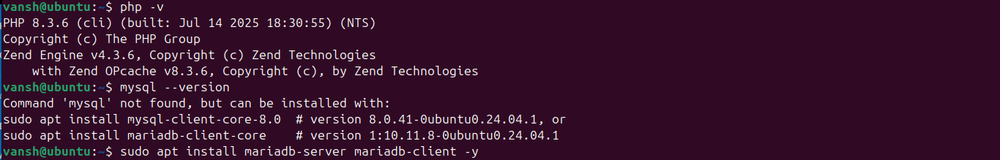 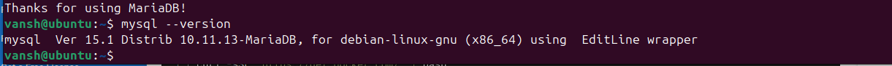

## Network and Host Configuration

-   Set static IP of Ubuntu server to 192.168.1.202
-   Update `/etc/hosts` to replicate a dns server pointing to the ubuntu webserver with `192.168.1.202 webserver.homelabserver`
-   Added 192.168.1.202 webserver.homelabserver to /etc/hosts on both Kali and Ubuntu
-   Check if the apache works 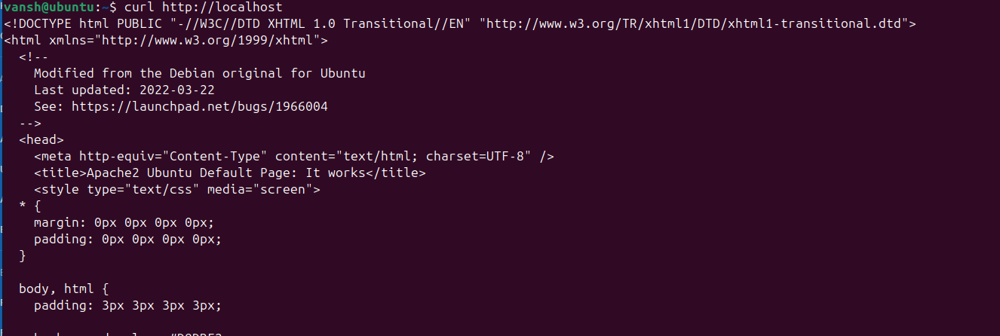
-   Check if I can ping it from kali 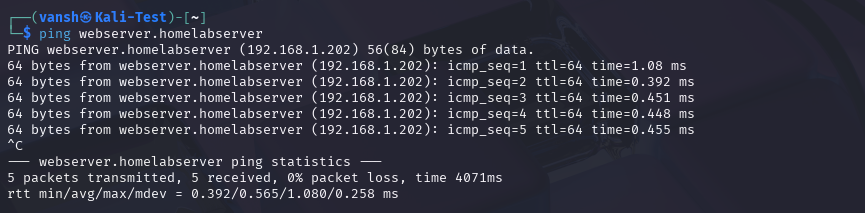
-   Verified from Kali with:
    -   `ping webserver.homelabserver`
    -   `curl http://webserver.homelabserver`
    -   Confirmed Apache and DVWA load

## DVWA Installation and Setup

-   Install git to get dvwa 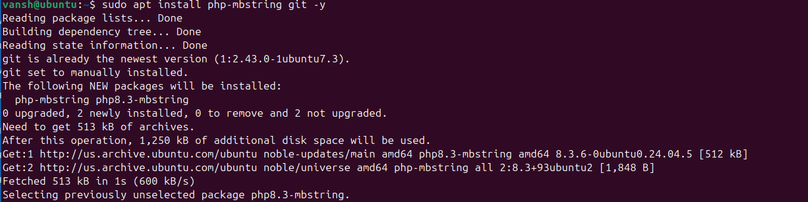
-   Clone DVWA into /var/www/html/DVWA
-   Move DVWA to Apache root: `/var/www/html/`
    -   Used `sudo mv /var/www/html/DVWA/* /var/www/html/`
    -   Cleaned up with `sudo rm -r /var/www/html/DVWA`
    -   Fixes recommended by chatgpt due to some errors I ran into
-   Change perms to allow webserver to read/write/execute files in the DVWA directory after cloning it in the /var/www/html which is default directory for web content according to chatgpt 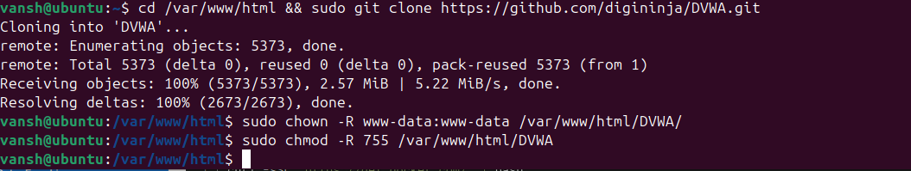
    -   7 for allowing owner to read/write/execute, 5 for group to read and execute and others to also read and execute.
    -   The image shows /DVWA but as I mentioned that was changed.
-   Gave permissions: `sudo chown -R www-data:www-data /var/www/html/`
-   Create DVWA database and user: 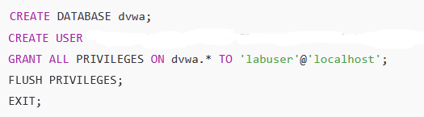
    -   Enter MySQL CLI: `mysql`
    -   `CREATE USER 'labuser'@'localhost' IDENTIFIED BY '[your-password-here]';`
    -   Exit MySQL: `exit`
-   Fix other errors by utilizing chatgpts help

## Apache Port Change

-   Changed Apache to run on port 8080:
    -   Edited `/etc/apache2/ports.conf`: `Listen 8080`
    -   Edited `/etc/apache2/sites-available/000-default.conf`: `<VirtualHost *:8080>`
    -   Restarted Apache: `sudo systemctl restart apache2`
    -   Verified with: `curl http://localhost:8080`
    -   All of this was done due a step later down the line which forces the webserver.homelabserver to run on HTTPS or PORT 443, however, it kept defaulting to HTTP and not redirect properly to the /login.php, and changing the port to :8080 and forcing HTTPS worked.

## Installing SafeLine WAF

-   Log into the SafeLine WAF! 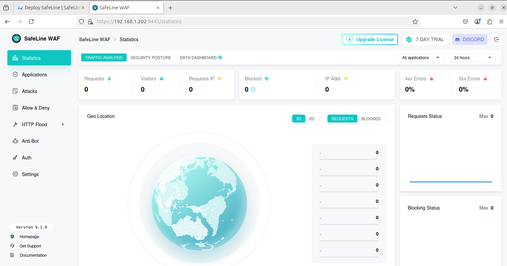
-   Installed with: 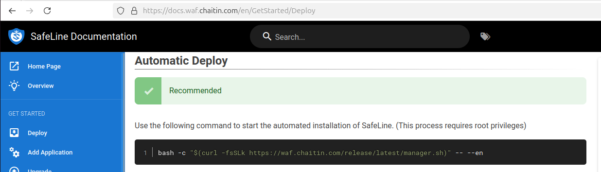
    -   `sudo bash -c "$(curl -fsSLk https://waf.chaitin.com/release/latest/manager.sh)" -- --env`
-   Logged into dashboard via: `https://192.168.1.202:9443`
-   Created HTTPS application
-   SafeLine WAF's HTTP Flood dashboard shows options such as rate limiting which is effective against DDoS Attacks
-   Configure the Apache2 webserver inside SafeLine WAF's application section
-   Generate a ssl cert to run port 443 (HTTPS), by first creating a `private.key` through `sudo openssl genrsa -out private.key 4096`
-   Create a CSR using the private key `sudo openssl req -new -key private.key -out private.csr`
    -   Fill in random info
-   Create a CRT using the CSR and Private Key `sudo openssl x509 -req -days 365 -in private.csr -signkey private.key -out private.crt`
-   Import the SSL Cert in SafeLine WAF settings, then fill in info regarding the application aka `Domain: webserver.homelabserver`, `PORT:443`, `Select SSL Cert: [the one we created here]`, `Reverse Proxy`, `Upstream: http://127.0.0.1:8080`
-   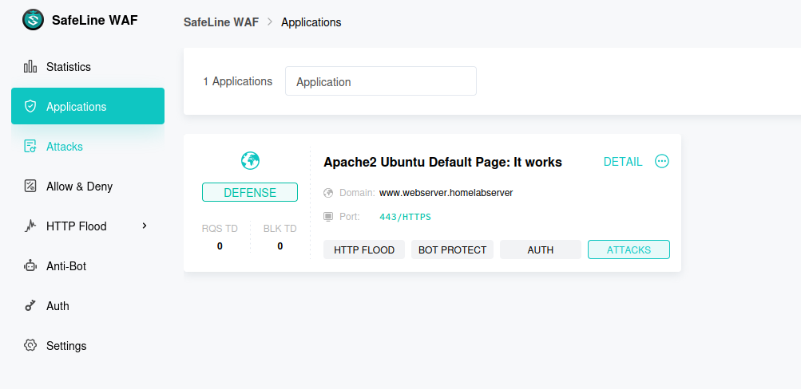

## SafeLine Behavior

-   Before forcing it to a HTTPS (port 443): 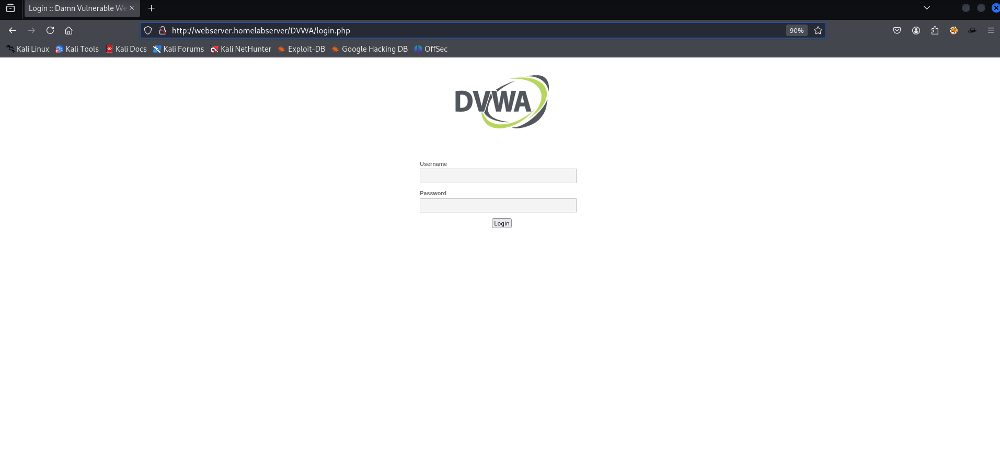
-   After forcing it to a HTTPS (port 443), no longer running HTTP: 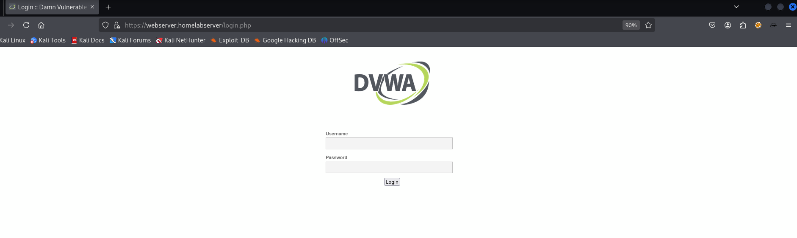
-   Verified forced HTTPS redirection worked
-   Removed HTTP listeners to prevent unprotected access

## SafeLine Protections Tested

-   Add a custom rate limiting rule for testing purposes 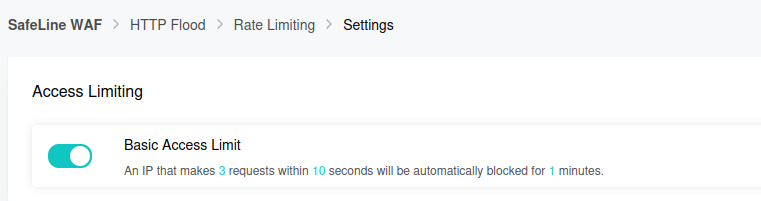
-   Rate Limiting / HTTP Flood:
    -   Created a rule to allow only 3 requests in 10 seconds
    -   After refreshing the page a couple times, we were blocked by the WAF 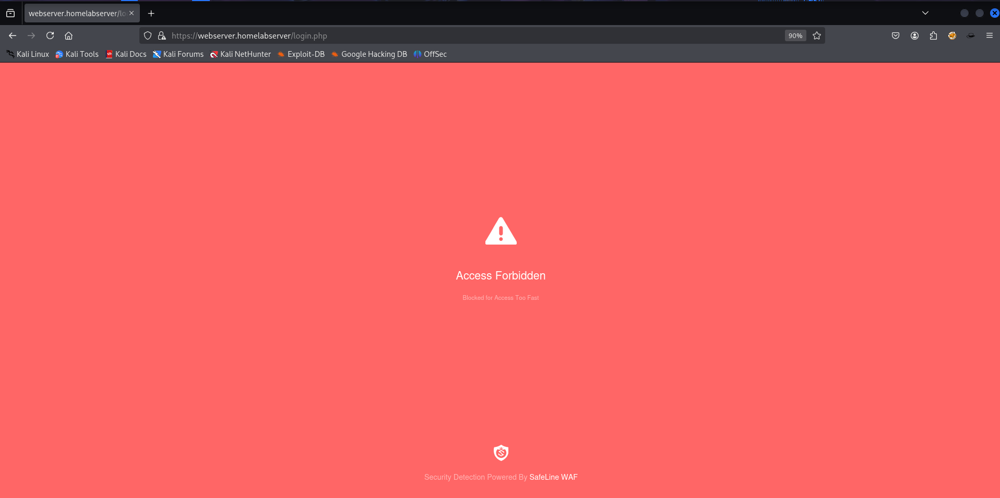
    -   The logs also support this 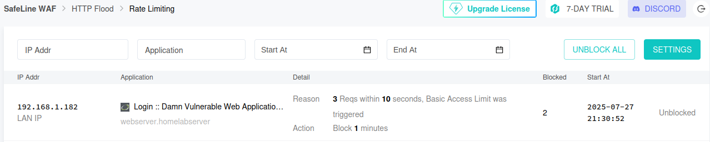
    -   Reloaded the page in browser multiple times and saw "Access Forbidden" screen
    -   Confirmed in SafeLine logs
-   Create a Authentication system 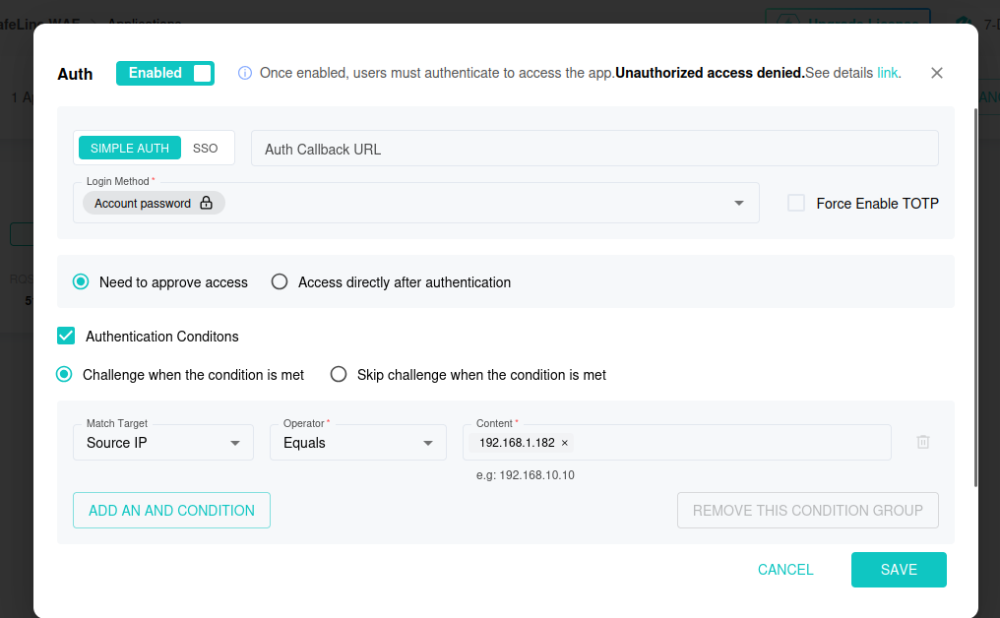
-   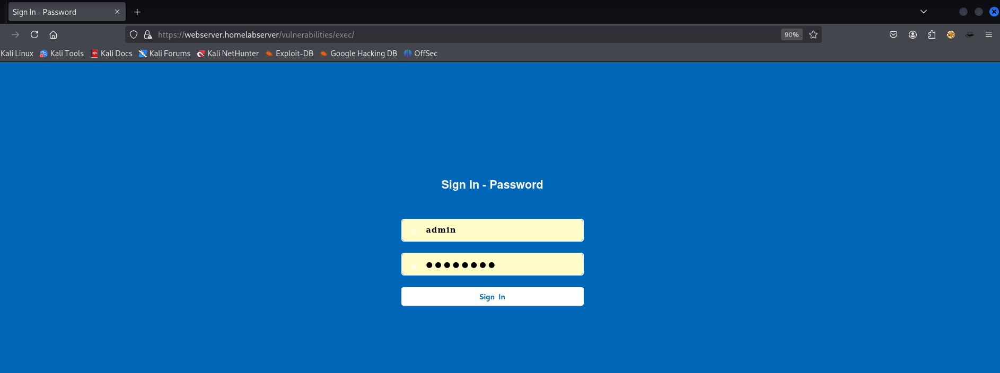
-   Authentication Rules:
    -   Enabled WAF-level auth with "Challenge when condition is met"
    -   Bound to IP address 192.168.1.182 (Kali)
    -   Change from Need to approve access to Access directly after authentication for it to work
-   Ultimately, we are let into the application because the kali linux ip address matches the one we inputted. 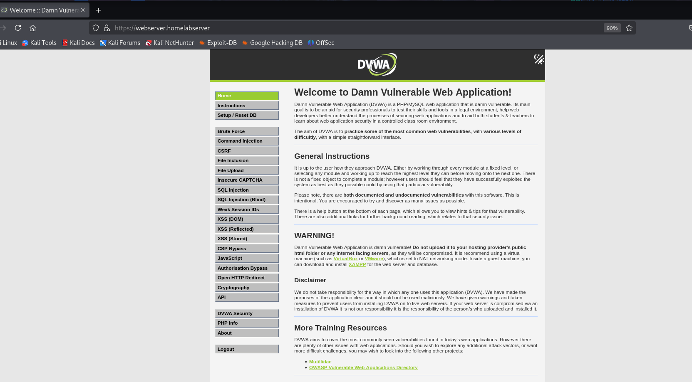

## SQL Injection Testing

-   Removing the http flood and auth, we test the sql injections, first with a simple `1' OR '1'='1`, what this means (after finding out from chatgpt) is that SQL queries regarding the input takes the values and inserts them like his `SELECT first_name, last_name FROM users WHERE id = '$USER_INPUT'` so when we do the `1' OR '1'='1` it looks something like this `SELECT first_name, last_name FROM users WHERE id = '1' OR '1'='1'` and the `'1'` is only true for the first User ID and false for the rest, but `'1'='1'` is ALWAYS true so it executes, but it is blocked due to default sql injection protection by WAF 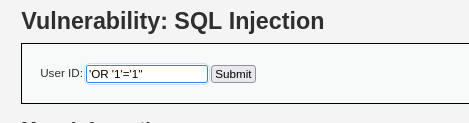
-   Accessed DVWA at: `https://webserver.homelabserver/vulnerabilities/sqli/`
-   Set security level to LOW at: `https://webserver.homelabserver/security.php`
-   Tested:
    -   `1' OR '1'='1` ✅ worked
    -   `'OR '1'='1'` ❌ failed due to syntax error
-   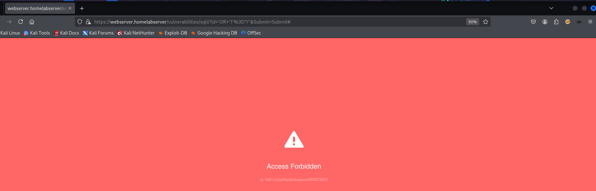
-   Saw "Access Forbidden" block when SQLi protection enabled
-   Disabled SQLi protection in SafeLine > WAF Rules
-   But if we turn OFF the sql injection protection from the WAF dashboard, we get something like this: 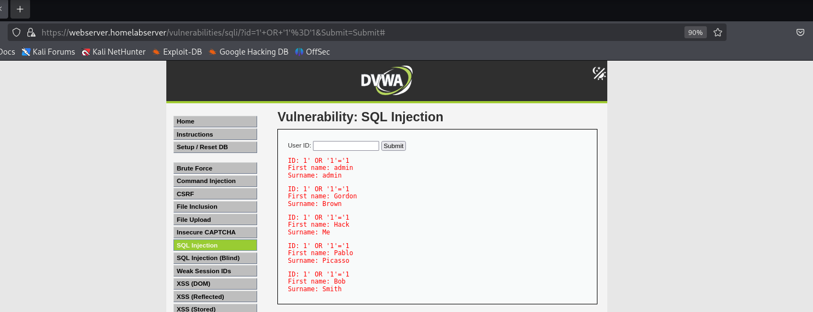

## Summary

### Home Lab Objectives Achieved

-   **DVWA Setup**: Successfully installed and configured DVWA (Damn Vulnerable Web Application) on Ubuntu server
-   **SafeLine WAF Integration**: Implemented SafeLine WAF as a reverse proxy with HTTPS enforcement
-   **Security Testing**: Tested and validated WAF protections against common attack vector (SQL Injection)
-   **Network Configuration**: Established proper network connectivity between Kali Linux and Ubuntu server

### Key Security Features Tested

-   **Rate Limiting**: Configured HTTP flood protection (3 requests per 10 seconds)
-   **Authentication Rules**: Implemented IP-based access control for specific clients
-   **SQL Injection Protection**: Demonstrated WAF blocking malicious SQL queries
-   **HTTPS Enforcement**: Forced all traffic through encrypted HTTPS connections

### Technical Insights Gained

-   **Port Management**: Changed Apache from default port 80 to 8080 for WAF integration
-   **SSL Certificate Management**: Created and configured self-signed certificates for HTTPS
-   **Database Security**: Properly configured MySQL/MariaDB with dedicated user accounts
-   **File Permissions**: Set appropriate ownership and permissions for web server security

### Attack Vectors Demonstrated

-   **SQL Injection**: Tested `1' OR '1'='1` payload with and without WAF protection
-   **HTTP Flood**: Simulated DDoS-style rapid requests to trigger rate limiting
-   **Bypass Attempts**: Attempted direct access to backend services

### Infrastructure Components

-   **Frontend**: SafeLine WAF (Port 443) → **Backend**: Apache/DVWA (Port 8080)
-   **Database**: MariaDB with dedicated DVWA database and user
-   **Network**: Static IP configuration with DNS resolution via hosts file
-   **Security**: Multi-layered protection with WAF, HTTPS, and access controls

### Real-World Applications

This lab demonstrates a production-ready web application security setup with:

-   Web Application Firewall (WAF) implementation
-   Reverse proxy configuration
-   SSL/TLS encryption through self-signed certificates
-   HTTPS enforcement by redirecting HTTP to HTTPS
-   Rate limiting and DDoS protection
-   Authentication and authorization controls
-   Vulnerability testing and validation
