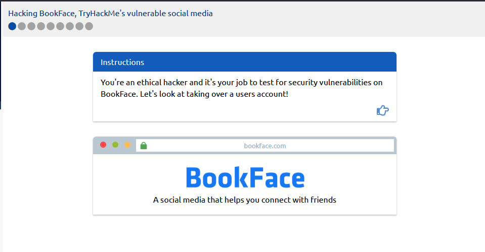
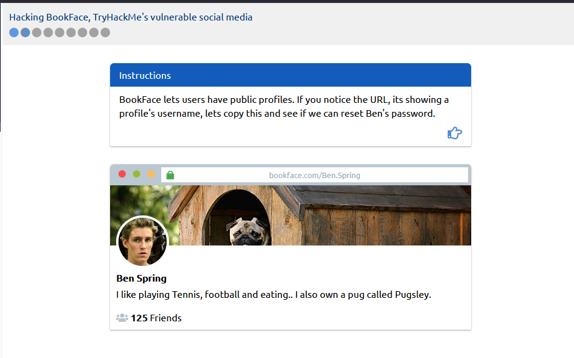
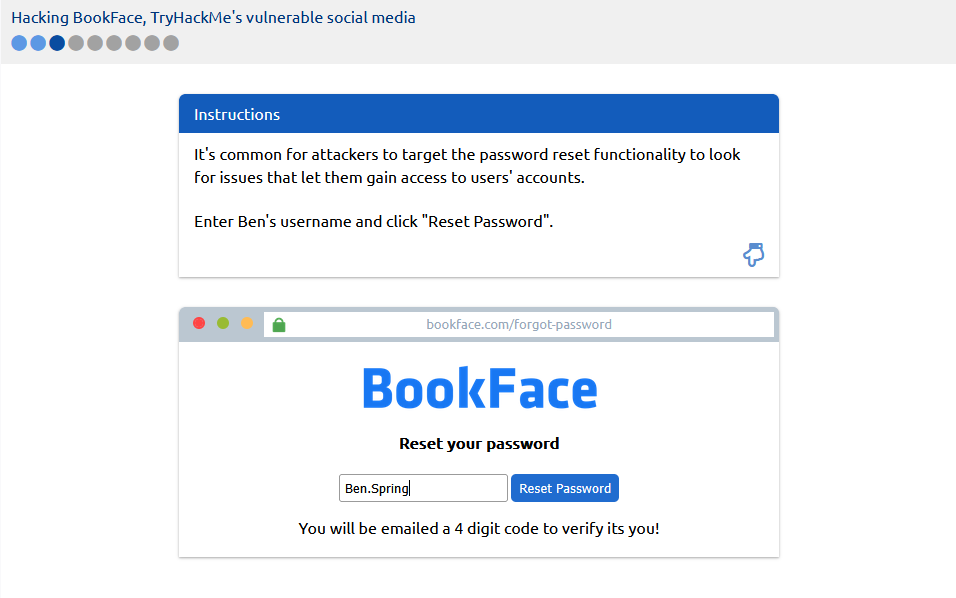
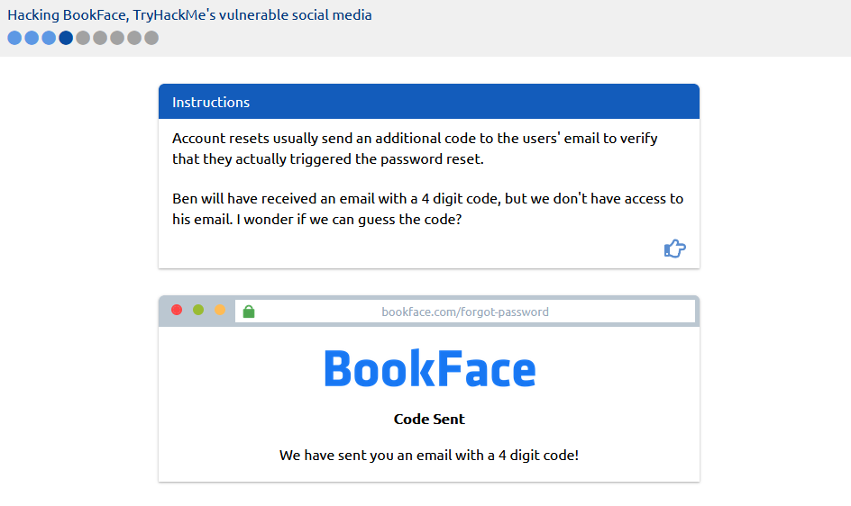
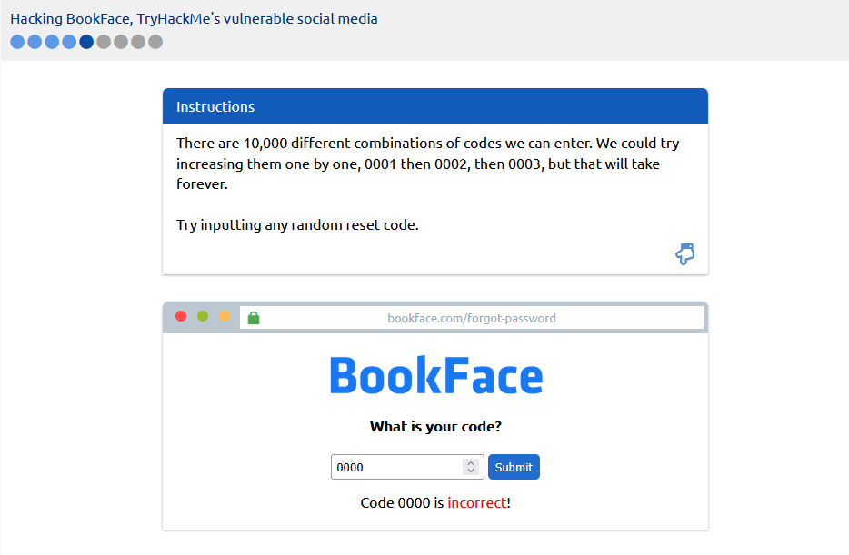
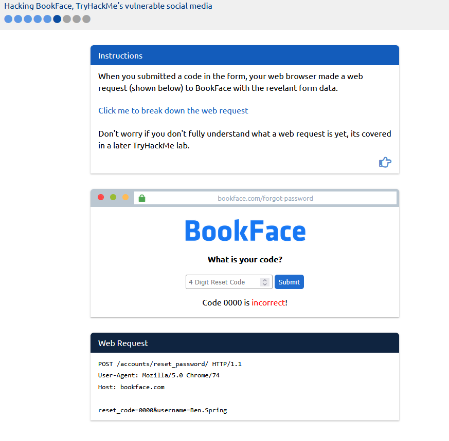
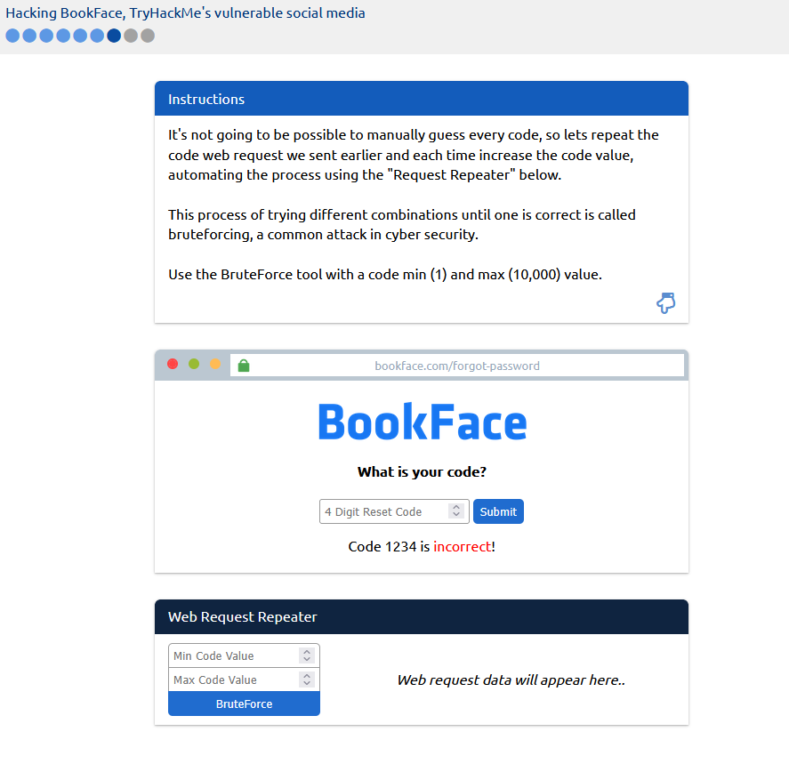
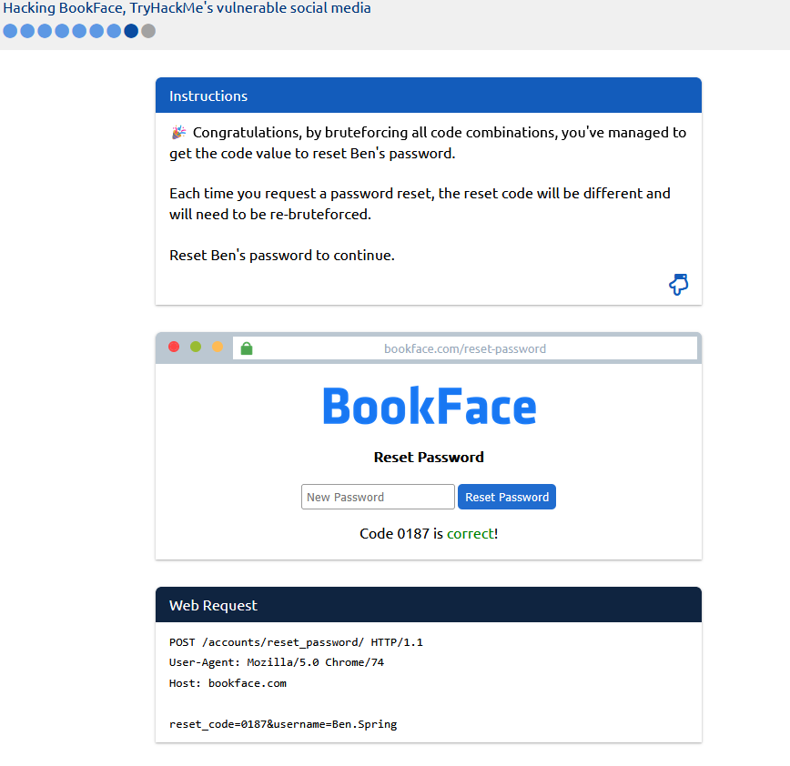
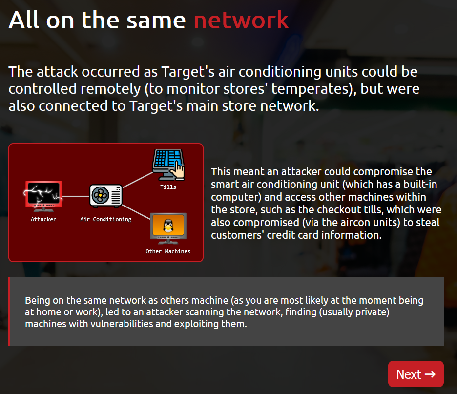
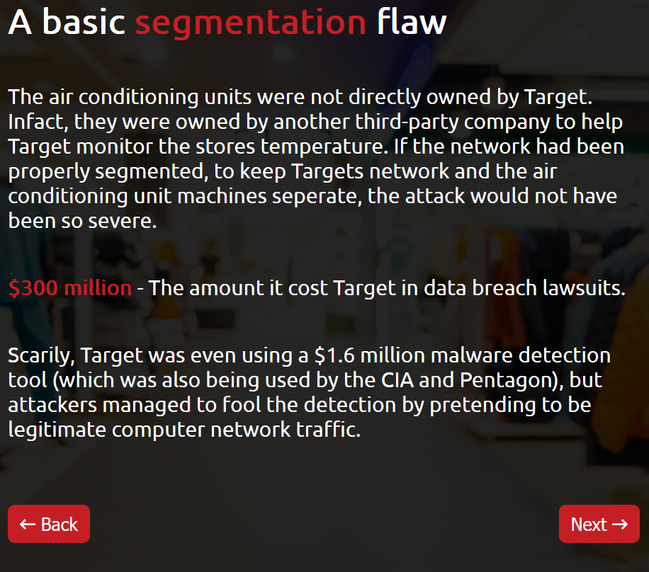

## Learning Cyber Security ([TryHackMe](https://tryhackme.com/room/beginnerpathintro))

### Summary:

#### Web Application Security:
    - If something is vulnerable, it means there is the possibility of it being attacked or harmed. If an application or system has a vulnerability, there is something that can be attacked or taken advantage of (a weakness)
    - 
    - 
    - 
    - 
    - 
    - 
    - 
    - 

#### Network Security
    - Networking is really important to understand in cyber security. From scanning and identifying who and what is on a network, to reviewing network logs to monitor and track what users have been up to will require you to have an understanding of how networks work. 
    - 
    - 
    - 
    - 