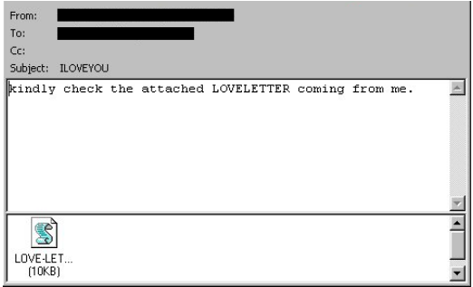
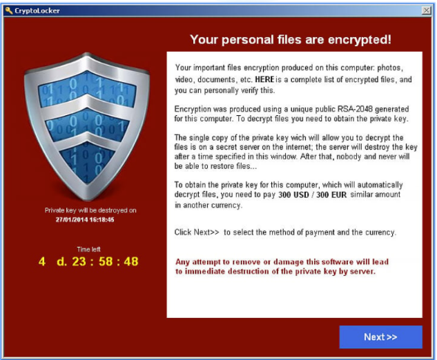
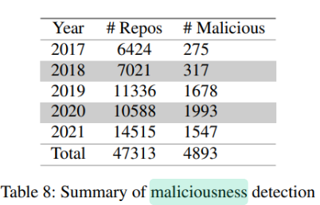
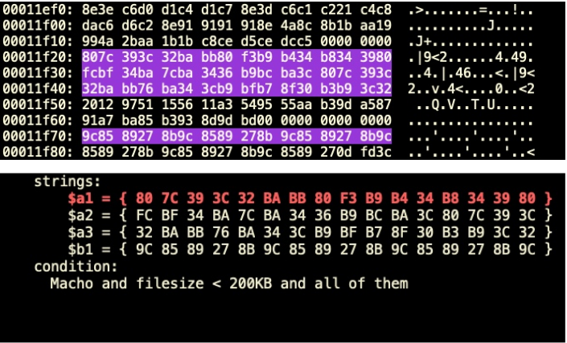
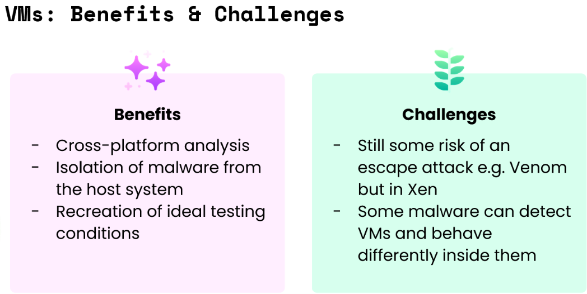
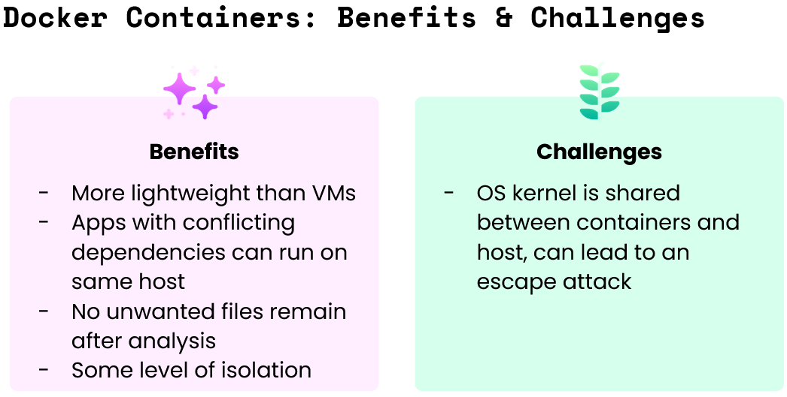
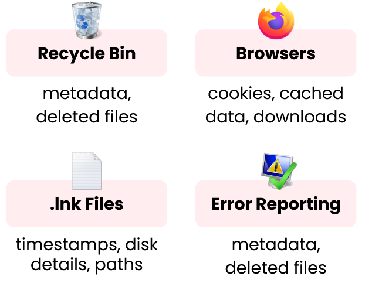
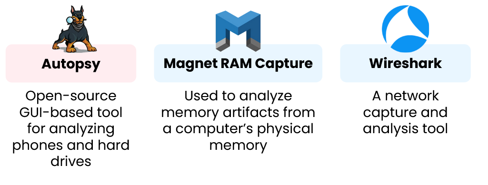
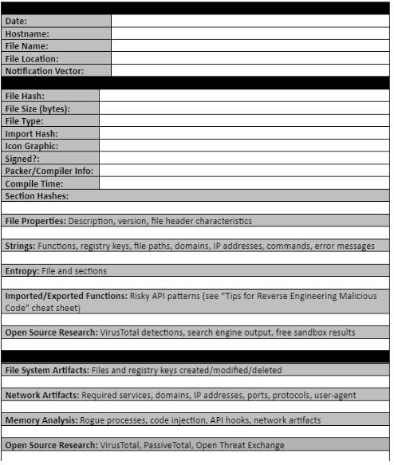

# CodePath 7/9/25 Lecture

## Malware Analysis

### Malware

-   Malware is software specifically designed to disrupt, damage, or gain unauthorized access to a computer system.
-   Viruses
    -   Malicious code that replicates by copying itself to another program, computer boot sector, or document
    -   Changes how a computer works
    -   Requires a host file to be activated before spreading
-   Worms
    -   Malicious code that replicates by copying itself to another program, computer boot sector, or document
    -   Changes how a computer works
    -   Spread on their own without a host file
-   Trojan Horses
    -   Malware concealed within a seemingly useful program and then executed when the program is opened
-   Ransomware
    -   Malicious code designed to block access to a system until a sum of money is paid
    -   Main targets: banking, manufacturing, energy & utilities, government, education
-   Blended Threat
    -   Cybercriminals often combine aspects of multiple threat types
    -   Example: using a Trojan horse to sneak in a virus
-   Malware Examples
    -   ILOVEYOU (2000)
        -   Delivered in an email with the subject line “I love you”
    -   CryptoLocker (2013)
        -   A type of ransomware
    -   Fake Proofs of Concept on GitHub (2017-2022+)
        -   Repos claiming to demonstrate security flaws via a non-harmful attack actually installed malware
-   ILOVEYOU
    -   Opening the attachment executed a Visual Basic script:
        -   Overwrote a random set of files
        -   Sent a copy of itself to all contacts in Microsoft Outlook address book
    -   
-   CryptoLocker
    -   Spread through email attachments
    -   Encrypted users’ files
    -   Hackers sent a decryption key for $$$
    -   
-   Fake GitHub PoCs
    -   PoCs are intended to reveal a vulnerability without exploiting it
    -   Researchers discovered blacklisted IPs & malicious code files stored on GH
    -   

### Antivirus Software

-   Antivirus software is a type of program meant to prevent, detect, and eradicate malware.
-   Types of Antivirus Software
    -   Malware signature
    -   Standalone
    -   System monitoring
    -   Security software suite
    -   Machine learning
    -   Cloud-based
-   Malware Signature Antivirus
    -   Malware signature: sequence of code typical of a specific piece of malware
        -   Like a digital fingerprint
        -   Often created via text or binary patterns
    -   This type of antivirus scans for malware signatures and disables matches
    -   Can only protect against known threats
-   Virus Signature Examples
    -   OceanLotus malware and a detection signature for it
    -   
-   System Monitoring
    -   Software that ascertains how a device is normally used through monitoring
    -   Software can then flag atypical behavior
    -   Provides real-time protection
    -   Examples:
        -   Attempts to connect to a suspicious website
        -   Attempts to access a large number of files
        -   An unusually large increase in data usage
        -   Unusual times of data usage
        -   Impossible travel

### Malware Analysis

-   Process Isolation
    -   Separate processes from each other to ensure one process cannot corrupt data or code of another process
    -   Minimizes inter-process communication
-   Virtual Machine
    -   Used to simulate all aspects of a hardware device
    -   Allows user to test how malware interacts with file system, registry, and more
-   
-   Docker Containers
    -   An executable package of software that includes everything needed to run an app
        -   Code
        -   Runtime
        -   System Tools
        -   System Libraries
        -   Settings
-   
-   Detonation within Sandboxes
    -   Open up files in a carefully isolated environment
    -   Observe the effects of the file, such as background processes
    -   Threat actors can evade sandboxing
        -   Detect if the program is running in a VM
        -   Lie dormant long enough to evade analysis
-   Forensic Analysis
    -   Analysis of digital evidence and investigation of security incidents to support vulnerability mitigation
-   Common Forensic Artifacts (Windows)
    -   
-   Some Tools for Forensic Analysis
    -   
-   Documentation and Reporting
    -   Keep a record of the attack and methods used to investigate
    -   Can use a word processing program, a wiki, a mind map, or something else
    -   Record the effects of the malware
-   Example Analysis
    -   An malware analysis document template used to record findings
    -   

### Week 6 Project 5: DIY Malware

-   `msfvenom` syntax follows the following pattern:
    -   `msfvenom -a ARCHITECTURE --platform PLATFORM -p PAYLOAD [ARGS] -f FORMAT -o OUTPUTFILE`
    -   `-a` is for the computer architecture. This is something determined by the kind of CPU in the computer you're using. Most modern computers run on x64 or x86 architecture.
    -   `--platform` is for what computing platform the virus should run on. For us, that means the `OS/programming language`, such as windows, osx, or python
    -   `-p` is the PAYLOAD. This is what the virus will actually do. MSFVenom offers hundreds built-in payloads, similar to metasploit modules.
    -   `-f` is the FORMAT of the output file. For example, .exe, .sh, .py, etc.
    -   `-o` is the output file -- the name of the virus you're creating!
-   We are going to use windows/messagebox
-   `msfvenom -a x86 --platform windows -p windows/messagebox TEXT="Virus Executed" -f exe -o messageVirus.exe`

    -   

-   Create a virus with multiple payloads
-   You need to create a first payload
    -   Using messagebox and saving it in `raw` format for instance:
        -   `msfvenom -a x86 --platform windows \`
            `-p windows/messagebox TEXT="Virus Executed" \`
            `-f raw > messageBox`
        -   the `\` character tells the terminal to continue the command on the next line
    -   This will generate a file called `messageBox`
-   Run another command with `-c` flag to bundle in the payload we just created:
    -   `msfvenom -c messageBox -a x86 --platform windows \`
        ` -p windows/speak_pwned -f exe -o pwnedVirus.exe`
    -   
-   Create a virus with an encrypted payload
    -   The syntax for this is:
        -   `-e ENCODER -i NUM_EXECUTIONS`
    -   To encrypt, we're going to wrap out payload in a python file, and encrypt it this time:
        -   ` msfvenom -a x86 --platform Windows \`
            ` -p windows/messagebox TEXT="Encrypted Virus" \`
            ` -e x86/shikata_ga_nai -i 3 -f python -o messageEncrypted`
        -   Then, using the encrypted file generated above, we'll create the virus file:
            -   `msfvenom -c messageEncrypted -a x86 \`
                `--platform windows -p windows/speak_pwned -f exe -o pyVirus.exe`
        -   
